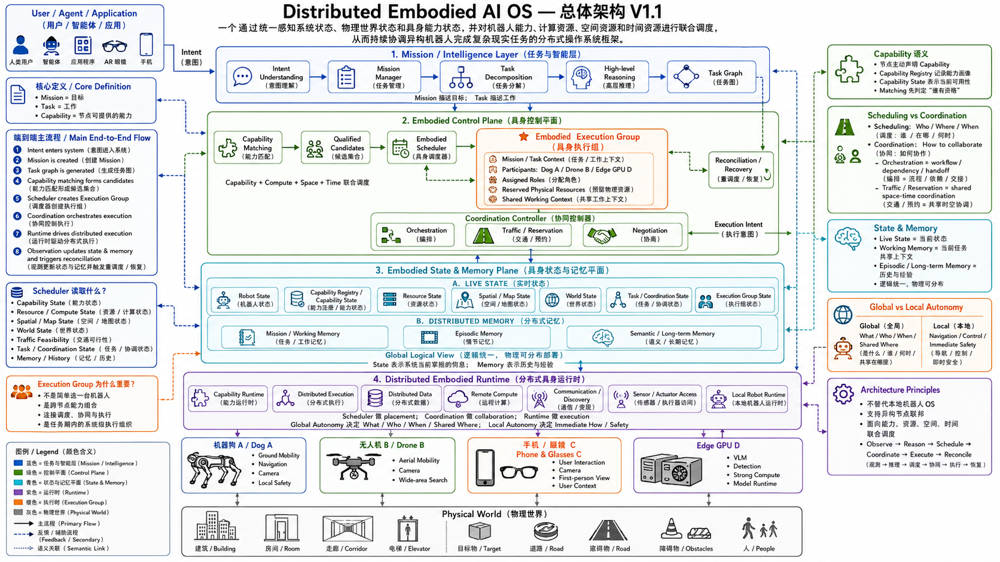

# RoboGuide

RoboGuide 是 Distributed Embodied AI OS 的架构与工程资料仓库。

当前阶段只完成架构基线整理和仓库初始化，暂不实现运行时代码、通信协议、调度算法或真实机器人控制。设计基线是仓库中的
`Distributed_Embodied_AI_OS_总体架构详细设计说明书_V1.1.docx`。

## 架构总览



上图表达系统的逻辑组成。详细职责、抽象输入输出和架构语义以 V1.1 文档为准；图片用于快速建立整体视图。

## 一句话定义

Distributed Embodied AI OS 是一个通过统一感知系统状态、物理世界状态和具身能力状态，并对机器人能力、计算资源、空间资源和时间资源进行联合调度，从而持续协调异构机器人完成复杂现实任务的分布式操作系统框架。

它不是把多台机器人简单接入同一个网络，也不是用一个中央模型替代所有机器人本地系统。它要解决的是：多个具身体、多个计算节点和共享物理世界如何形成可观察、可调度、可协调、可恢复的系统级闭环。

## 架构主脊梁

```text
Intent
  -> Mission
  -> Task / Task Graph
  -> Capability Matching
  -> Qualified Candidates
  -> Embodied Scheduler
  -> Embodied Execution Group
  -> Coordination / Execution Intent
  -> Distributed Runtime
  -> Local Robot Runtime / Physical World
  -> State & Memory
  -> Reconciliation
```

运行时闭环是：

```text
Observe -> Reason -> Schedule -> Coordinate -> Execute -> Reconcile
```

这不是一次性的“规划后执行”流水线。物理世界变化、节点状态变化、能力变化、任务反馈和失败事件都会回到 State & Memory，再由 Reconciliation 判断是否继续、调整、重新协调或重新调度。

## 四个逻辑平面

### 1. Mission / Intelligence Layer

回答“系统要完成什么”。

- 接收用户、Agent、Application 或设备产生的 Intent；
- 理解目标、范围、约束和完成条件；
- 建立 Mission 生命周期和目标上下文；
- 将 Mission 分解为 Task；
- 形成带有依赖、并行关系、条件分支和完成关系的 Task Graph；
- 为高层推理提供上下文，但不直接选择机器人，也不直接控制电机。

核心边界：`What` 属于 Mission / Intelligence，执行者由后续能力匹配和调度决定。

### 2. Embodied Control Plane

回答“谁来做、在哪里做、什么时候做，以及如何协作”。

- `Capability Matching`：判断哪些节点“有资格做”；
- `Embodied Scheduler`：联合考虑 Capability、Compute、Space、Time，决定 `Who / Where / When`；
- `Embodied Execution Group`：把参与节点、角色、任务上下文、共享资源和执行边界组织起来；
- `Coordination Controller`：管理编排、同步、Traffic / Reservation 和 Negotiation；
- `Reconciliation / Recovery`：比较计划状态与现实状态，推动继续、调整、重调度或重构。

核心边界：Scheduling 决定资源与角色，Coordination 决定参与者如何合作，二者都不替代本地实时控制。

### 3. Embodied State & Memory Plane

回答“系统当前掌握的现实是什么，以及过去发生过什么”。

#### Live State

- Robot State：位置、姿态、在线性、健康、电量和当前活动；
- Capability Registry / Capability State：通常能做什么，以及现在是否可用；
- Resource / Compute State：CPU、GPU、内存、带宽、电量和模型可用性；
- Spatial / Map State：Metric、Topological、Semantic 空间关系和可达性；
- World State：目标物体、门、电梯、通道、人员和区域等任务相关世界状态；
- Task / Coordination State：任务进度、依赖、等待、阻塞和资源占用；
- Execution Group State：成员、角色、预约、健康和当前执行阶段。

#### Distributed Memory

- Local Memory：节点近期感知、执行上下文、轨迹和离线自治记录；
- Mission / Working Memory：当前 Mission 或 Execution Group 的共享工作上下文；
- Episodic / Semantic / Long-term Memory：跨 Mission 的事件经历、环境语义、知识和历史经验。

核心边界：`State = Reality Now`，`Memory = Reality Over Time`。逻辑上统一不要求物理上集中。

### 4. Distributed Embodied Runtime

回答“如何把系统级组织结果真正运行到异构节点”。

- Capability Runtime：启动、调用和管理选定能力；
- Distributed Execution：把 Execution Intent 下沉到参与节点并汇聚反馈；
- Distributed Data：传递感知数据、模型输入、结果和任务事件；
- Remote Compute：将数据产生位置和计算位置解耦；
- Communication / Discovery：提供节点发现、连接、心跳和基础传输能力；
- Sensor / Actuator Access：连接摄像头、LiDAR、IMU、麦克风、电机和机械臂等设备；
- Local Robot Runtime：承接本地导航、局部规划、控制、实时闭环和最终安全裁决。

核心边界：Control Plane 决定如何组织系统，Runtime 负责把组织结果执行起来；Local Runtime 保留 `Immediate How` 和最终 `Safety Veto`。

## 核心一等对象

| 对象 | 语义 |
| --- | --- |
| Intent | 用户、Agent 或 Application 的原始意图，不是直接执行单元 |
| Mission | 系统级目标、整体上下文、生命周期和完成判据 |
| Task | 为完成 Mission 而需要做的工作，不直接绑定节点 |
| Task Graph | Task 的依赖、并行、条件分支和完成关系 |
| Capability | 节点可以提供的可执行能力 |
| Execution Group | 为某个 Mission / Task 阶段动态组成的跨节点执行组织 |
| State | 系统当前掌握的实时或近实时状态 |
| Memory | 跨时间保存的任务上下文、事件经历、知识和经验 |
| Reconciliation | 现实状态与计划偏离后重新进入决策闭环的入口 |

## Execution Group 为什么重要

Execution Group 不是固定 Fleet，也不是简单的节点列表，更不是一台“万能机器人”。它是一个面向当前 Mission / Task 阶段的临时执行组织，能够同时承载：

- 多个机器人或设备的参与者关系；
- 每个参与者承担的 Assigned Role；
- Mission / Task 的共享工作上下文；
- 走廊、电梯、道路、充电站等共享物理资源；
- 跨机器人、边缘 GPU、手机和其他计算节点的执行进度；
- 异常时的局部替换、等待、降级或整体重构入口。

因此，Scheduler 的核心产物不是“选中一台机器人”，而是形成一组可执行的跨物理资源与计算资源组合。

## Global Autonomy 与 Local Autonomy

| 自治层 | 负责的问题 | 典型职责 |
| --- | --- | --- |
| Global / System-level Autonomy | `What / Who / Where / When / Shared Where` | Mission、Task、Capability Matching、Scheduling、Execution Group、Coordination、Traffic |
| Local Autonomy | `Immediate How / Real-time Control / Safety` | 局部规划、避障、导航、运动控制、设备闭环、本地安全 |

全局控制平面可以表达“Dog A 去 Room 302，并遵守其他执行组的空间预约约束”，但不能直接决定四足机器人如何绕过眼前椅子，也不能在网络断开时阻止本地安全机制执行保护动作。

## 端到端流程

1. 用户、Agent、Application 或设备提交 Intent；
2. Mission / Intelligence Layer 理解 Intent，创建 Mission 并形成 Task Graph；
3. Capability Matching 从 Registry / State 中筛选 Qualified Candidates；
4. Embodied Scheduler 联合考虑能力、算力、空间、时间和历史上下文；
5. Scheduler 创建 Embodied Execution Group，明确成员、角色和共享资源；
6. Coordination Controller 组织编排、同步、预约和协商；
7. Distributed Runtime 将 Execution Intent 下沉到各节点；
8. Local Runtime 在本地完成导航、控制、设备访问和安全闭环；
9. 观测、执行结果、节点状态和环境变化更新 State & Memory；
10. Reconciliation 比较实际状态与计划状态，必要时重新协调或调度。

## 当前阶段边界

当前仓库只做架构资料初始化，不写实现代码。暂不冻结或实现以下内容：

- Capability 的具体 Schema、字段和版本兼容策略；
- Agent、Adapter、SDK、Plugin、ROS Bridge 等节点接入方式；
- Control Plane 的进程拆分、高可用、Leader Election 和一致性算法；
- State / Memory 的数据库、缓存、事件总线和复制机制；
- Scheduler 的规则、优化、拍卖、强化学习或混合算法；
- Traffic 的时空图、Reservation 数据结构和冲突求解；
- DDS、Zenoh、gRPC、WebRTC、MQTT 等通信技术选型；
- 真实硬件控制、安全、权限、心跳、超时和故障恢复实现。

这些内容集中记录在 [`docs/implementation-backlog.md`](docs/implementation-backlog.md)，等待后续实验和工程验证后再决定。

## 仓库内容

```text
.
├── docs/
│   ├── architecture-baseline-v1.1.md
│   └── implementation-backlog.md
├── docs/images/
│   ├── README.md
│   └── distributed-embodied-ai-os-architecture-v1.1.png
├── Distributed_Embodied_AI_OS_总体架构详细设计说明书_V1.1.docx
└── README.md
```

当前没有 `src/`、测试代码或运行时实现。后续新增模块时，必须先说明它所属的逻辑平面、职责边界、输入输出所有权、时间语义、失败反馈路径，以及是否需要新增 ADR。
