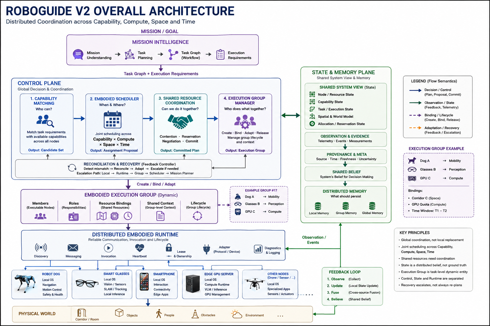

# RoboGuide V2 架构基线

> 当前架构基线。权威来源是 [`RoboGuide_Architecture_Baseline_V2.docx`](RoboGuide_Architecture_Baseline_V2.docx)。本文档是面向仓库的结构化摘要，不替代原始 DOCX。



## 1. 系统定位

RoboGuide 是面向异构具身智能体协作的通用分布式操作系统框架。它联合调度
Capability、Compute、Space 和 Time，同时保留每个节点的本地自治能力。

RoboGuide 不只是一个 Scheduler，还负责资源抽象、共享状态、任务与执行生命
周期、分布式调用、协同和恢复语义。

## 2. 逻辑架构

| 组件 | 职责 |
| --- | --- |
| Mission / Application | 提供外部 Mission / Goal，不直接控制设备 |
| Mission Intelligence | 生成带 Context/ContextRole 的完整 MissionPlan、Task Graph 和 Execution Requirements |
| Control Plane | 完成能力匹配、分配提案、共享资源协调、计划提交、Group 内 TaskExecution 绑定和恢复决策 |
| Mission Orchestration | 持有完整 MissionPlan，推进 DAG readiness，并根据 Runtime execution facts 明确驱动 Mission/Group 终态 |
| State & Memory Plane | 横向维护证据、共享系统视图、分配状态、Shared Belief 和分域记忆 |
| Embodied Execution Group | 由 Control/Runtime 承载 Mission-level 多 Task 分布式执行上下文 |
| Distributed Embodied Runtime | 持续承载已 Commit 的 Group/TaskExecution 运行上下文，管理 execution identity、事件、timer、取消和 checkpoint/resume |
| Integration | 提供 Node Protocol、Messaging、Transport、Session 和 Router，不拥有执行生命周期 |
| Local Embodied Systems | 保留感知、导航、运动、硬件控制和即时安全能力 |
| Physical World | 被执行过程改变，并持续向系统反馈 Observation |

逻辑组件可以共址，也可以分布部署。部署拓扑不得改变组件的职责和权威语义。

## 3. 核心抽象

### Embodied Node（具身节点）

可被发现、能够执行任务或提供资源的系统参与者。节点类型可以包括 Robot、
Perception、Interaction、Compute 和 Infrastructure Node。Node 不等同于 Robot。

每台参与节点机器运行一个通用 `roboguide-node`，作为 RoboGuide Runtime 在该机器上的
接入端。它通过 Node Protocol 主动连接 RoboGuide Server，并在进程内部使用声明式
Local Integration Engine 连接一个或多个 Local Embodied Systems。Adapter 是该引擎的
配置与驱动职责，不是每种 EAIOS 各自部署的 RoboGuide 服务或编译期插件。

Local Integration Engine 只执行部署者提供的、启动时完整校验的本地配置。配置声明
Local System、Capability、Sensor、Resource、固定 Endpoint、受限字段映射和执行生命
周期；不得把厂商 SDK、ROS Topic、Atlas/Pilot 等 Local How 提升为全局协议或 Control
语义。新增 Local EAIOS 不修改或重新编译 RoboGuide Server 与 `roboguide-node`。

### Capability 与 Resource

Capability 描述 Node 当前能够执行什么；静态能力支持不代表运行时一定可用。
RoboGuide 联合调度四类资源：

- Capability：可执行的具身或计算能力；
- Compute：CPU、GPU、NPU、模型和执行容量；
- Space：位置、路线、区域、占用和共享物理设施；
- Time：前置关系、同步窗口、截止时间和占用区间。

### Embodied Execution Group（具身执行组）

Mission 进入实际执行阶段后形成的长期分布式执行上下文，由 Members、Roles、多个
TaskExecution、已提交的 Resource Bindings、Recovery Context 和 Lifecycle 组成。v0.x
默认一个 Mission 创建一个 Group，但该策略不是未来拆分多个 Group 的领域硬约束。

Role 是 Task 内与具体 Node 解耦的职责槽位：Capability 说明 Node 是否具备承担
该 Role 的能力，Assignment 记录当前由哪个 Node 承担，Resource Binding 记录执行
该职责已经提交的资源。Task 完成只释放属于该 Task 的临时 binding/reservation，不销毁
Group。节点故障时，Group 内可以 partial release、rebind，并经 `Adapted → Active`
继续执行；只有 Mission 完成或最终失败后，Group 才进入 `Completed/Failed → Released`。

Member 与 Binding 必须区分：GPU Node 可以是 Member，GPU quota 是 Compute
Binding；走廊是 Spatial Binding，不是 Member。Group Manager 属于 Control Plane，
负责 committed binding、reservation、rebind 和 release authority；Group 的 live execution
context 由 Runtime 承载并跨节点运行。State 只保存二者的事实和投影。

## 4. 决策与承诺语义

```text
Plan → Match → Schedule → Propose → Coordinate → Commit → Bind → Execute
```

1. Capability Matching 输出 Candidate Set，回答 `Who can?`；
2. Embodied Scheduler 输出 Assignment Proposal，回答 `Who should / Where / When?`；
3. Shared Resource Coordination 检测竞争，并执行 Reservation、Negotiation 或重新分配；
4. Commit 使资源义务生效，并在 Allocation / Reservation State 中可观察；
5. Mission Orchestration 在执行阶段从完整 DAG 创建一个 Mission-level Group 和全部 TaskExecution；
6. Control 将每个 Task 的 Committed Plan 绑定回同一个 Group；
7. Runtime 接收 committed execution configuration，承载绑定后的执行过程并产生 canonical
   execution facts；Integration 只负责把 command/event 送达正确的 Node session。

未提交的 Proposal 绝不能被当作已经生效的资源分配。

## 5. 状态、证据、信念与记忆

State & Memory 是横向基础设施，包含：

- Node / Resource State；
- Capability State；
- Task / Execution State；
- Spatial & World Model；
- Allocation / Reservation State；
- Shared Belief；
- Distributed Memory。

```text
Observation → Source / Provenance → Timestamp → Freshness / Uncertainty
            → Fusion / Reconciliation → Shared Belief
```

Shared Belief 是面向决策的视图，不等于绝对 Ground Truth。冲突或过期证据必须
能够被表达和保留。Memory 具有 Local、Execution Group 和 Global 三种作用域；
Group 专属上下文默认不向全局广播。

## 6. Runtime 与本地自治

Runtime 是持续驱动已经 Commit 的分布式具身执行运行下去的执行环境。它维护
Mission-level Group 的 live context、TaskExecution 状态、execution identity、依赖推进、
timer、取消、事件归约以及 checkpoint/resume；它不执行 Matching、Scheduling、Reservation、
Commit 或 replacement selection。

Integration 定义 Node Protocol、Messaging、Transport、Session、Router 和 wire conversion。
DDS、ROS 2、gRPC、MQTT 和序列化属于 Integration 实现选型，不因此获得 execution
lifecycle authority。Node Service / Adapter 将 canonical execution intent 映射到本地 How，
并维护节点侧 durable execution continuity；它不管理 Mission 或 Group 生命周期。

节点侧部署边界固定为单一 `roboguide-node` 服务。其 Local Integration Engine 可内置
多种通用传输驱动，但具体能力 owner 在单个 Node 配置内必须唯一，不得在未知物理执行
状态下自动切换本地系统或重放动作。

Global Coordination 负责 `What / Who / When / Shared Where`。Local Embodied
Systems 保留 `Immediate How`、Navigation、Local Planning、Perception、Motion、
Hardware Control 和 Safety。

## 7. 对账与恢复

```text
Detect → Reconcile → Adapt
```

恢复只升级到完成任务所需的最低层级：

| 层级 | 所有者 | 处理方式 |
| --- | --- | --- |
| L0 | Local Autonomy | 避障、短程重规划、运动重试、安全停机 |
| L1 | Runtime | 重连或恢复调用/通信 |
| L2 | Execution Group | 替换成员、重新绑定或调整 Group |
| L3 | Scheduler / Coordination | 重新 Propose、Coordinate 和 Commit |
| L4 | Mission Intelligence | Task Graph 已无法满足 Mission 时重新规划 |

## 8. 已冻结不变量

- Proposal 与 Commit 相互区分；
- 已提交 Binding 是可观察的系统状态；
- Group 成员关系和 Binding 具有明确生命周期；
- Local Safety 不能被远程全局控制覆盖；
- Shared Belief 表达不确定性、过期性、来源和冲突；
- Node 在线状态与 Capability 可用性相互区分；
- 任务完成是系统级 Execution State，不是单次动作的返回值；
- 恢复必须针对当前世界重新对账，不能重放过期命令；
- State 和 Memory 具有作用域；
- 替换实现不能改写架构语义。

## 9. 开放架构问题

V2 有意保留七个问题：State Authority、Spatial Authority、Control Topology、
Execution Group Authority、Scheduling vs Runtime Coordination、Temporal Assurance
和 Resource Commitment Semantics。跟踪列表以及 MVP 决策见
[`implementation-backlog.md`](../../implementation-backlog.md)。

## 10. 版本关系

V2 取代 V1.1，成为当前权威架构基线。V1.1 保存在
[`../v1.1/README.md`](../v1.1/README.md)，用于历史比较。架构变化必须先更新
基线，再同步总体架构图、README、PPT、论文和实现文档。
