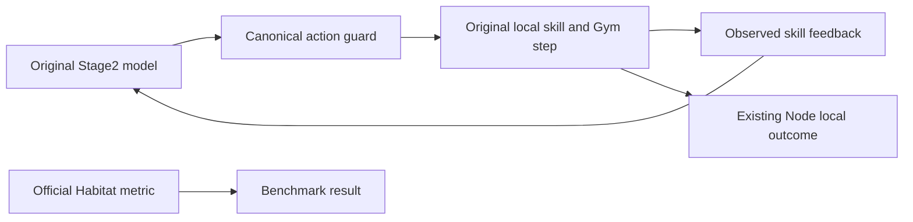

# ADR-0069: Observed local skill feedback at the Stage2 boundary

- Status: Accepted
- Scope: Habitat Local EAIOS model-input feedback; no Core or MissionPlan change

## Context

The original EMOS model client adds a tool receipt containing `Success` as soon
as it selects an action, before the action's skill runs. The original high-level
policy subsequently introduces each request with “You have completed your
previous action.” Neither statement distinguishes local arrival from a skill
step budget or a high-level interruption. In particular, the original
`SkillPolicy.should_terminate` can return control when `_is_skill_done` is false.

RoboGuide's existing execution loops already require their local navigation
terminal measure or official Habitat episode success to report `COMPLETED`.
They do not report completion merely because the skill returns control. The
missing link is truthful feedback to the next local model decision.

## Decision

The deployment-owned `stage2_feedback.py` supplies
`observed-local-skill-feedback/v0.1` in the controlled Stage2 path. It replaces
only the model client's synthetic tool receipt, after the independent action
guard admits the raw action. Raw assistant responses, selected tools, canonical
targets, arguments, and CrabAgent dispatch remain unchanged.

Each receipt is bound to its exact Provider tool call ID, agent/model instance,
invocation digest, and execution-scoped action sequence. It initially records
`accepted-awaiting-observation`, not success. Unsupported or mismatched receipt
formats fail before dispatch instead of accepting an unattributed success claim.

Scoped instance hooks observe the original `should_terminate` call and the
original `_is_skill_done` result returned inside that call. Each original method
runs exactly once; the observer neither repeats completion calculations nor
modifies returned tensors, counters, actions, or exceptions. A shared mutable
skill instance across agents is not attributable and fails installation.

The feedback distinguishes these observations:

| Status | Evidence |
| --- | --- |
| `local-skill-completed` | Actual original completion result, or the execution loop's existing post-step Oracle terminal measure |
| `wait-finished` | Actual completion of the original wait skill; no navigation or peer-delivery claim |
| `skill-budget-exhausted` | Original completion was false and the original counter reached its existing bound |
| `high-level-interrupted` | Original completion was false and the original high-level termination flag was true |
| `termination-result-unavailable` | Original skill returned control/abort but its completion or cause was not fully readable |
| `completion-evidence-unavailable` | The original completion input predates every actual Gym step of this selected action and has not been confirmed by an exact retry boundary |
| `original-skill-exception` | Original termination method raised; the same exception continues to propagate |
| `segment-ended-without-observed-skill-termination` | Segment closed without an attributed termination observation |

An exact, model-selected retry may observe original completion on its first
policy input after earlier physical work already changed the world. That result
stays unknown until the existing Gym step returns successfully. Confirmation
requires the same model instance, agent, invocation, tool and complete raw
arguments; a predecessor with actual Gym work and a definite non-aborting budget
or high-level exit; and the retry's original completion at a fresh first-step
counter below its budget. The receipt retains the predecessor call/sequence and
physical-step count, the original termination fields and both observation times.
No completion calculation or Gym call is repeated. Changed calls, new attempts,
first actions, unknown exits and failed Gym steps cannot inherit this evidence.
Confirmation emits one sparse `retry-terminal-confirmed` boundary, including
for navigation; it never asserts official goal satisfaction or initiates a retry.

Simultaneous termination flags remain in the record. A budget decision reads the
policy-input state before the following physical Gym step. If that final step
actually reaches the local terminal measure, the existing loop forwards that
already-read observation and supersedes the earlier incomplete state. It does
not perform another sensor or PDDL query.
The bridge counts only existing successfully completed Gym steps, without
serializing at step frequency. A completion input before the action's first
physical step can belong to earlier work; it remains unknown for this action.

On the next original model call, the adapter retains the original task and tool
request but replaces the known unconditional completion sentence with a neutral
reference to the recorded feedback. It does not add a retry instruction, select
the next action, invent a route, or expand any budget. The model may choose a
different next action because it now receives a different, observed result.
The exact-target Contract Guard still independently checks that choice.
The current user message includes the attributed feedback object, so the result
remains available even when the vendor uses a limited or empty history window.

`roboguide.stage2-execution-feedback/v0.1` always leaves
`benchmark_goal_satisfied` null. `local_skill_completed` describes the named
local skill, including wait, rather than Task/Mission satisfaction. Official
Habitat metrics, Node execution outcomes, and Orchestration satisfaction keep
their existing authority.

## Evidence and limits

`stage2-execution-feedback.jsonl` records admitted, terminated, model-input and
segment-exit observations. It retains the original synthetic receipt beside
the initial replacement. The separate
`stage2-execution-feedback-audit.json` reports completeness, drops and I/O faults.
The model-input event records preparation before the original client call; it
does not prove Provider receipt or a response. Records are bounded to 64 KiB and
stream only at action/termination boundaries,
not every simulator step. Pending memory retains one action per assigned agent.
Diagnostic I/O failures do not restore optimistic feedback or alter physics.
Missing interfaces or values remain unknown. Hooks are restored at segment exit;
new attempts never inherit the old observer's pending result.

The existing navigation Local How artifact includes the independently versioned
`stage2_execution_feedback_profile`; its existing navigation schema version
continues to describe the selected geometry/arrival profile. Runtime provenance
also digests the loaded feedback module. This is a disclosed RoboGuide arm
difference from native EMOS's synthetic feedback, not an equivalent native arm.
Historical logs and benchmark results remain unchanged.

B1 reset-route preflight recognizes the exact feedback revision separately
from the navigation version and verifies the declared module's bytes. The
profile and source must occur together; unknown revisions, changed sources,
unrelated fields and inconsistent digests fail closed. Historical archives
without either declaration retain their original navigation validation.

Offline regression establishes binding, result distinctions, original-method
call counts, exception preservation and single/paired execution integration.
It does not establish future model recovery behavior, physical reachability,
official goal satisfaction, or a benchmark success-rate improvement. Known
static route misses require separate capability/path evidence; changing robot
climb, slope, radius or safety filters is not part of this decision.

The feedback edge stays inside Local EAIOS. It grants no Control reservation,
reassignment, cancellation, Task satisfaction or execution-time MI replanning.
