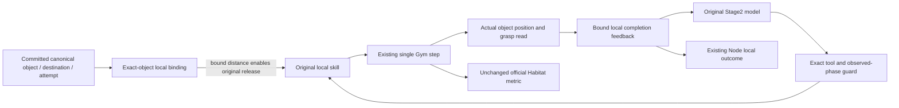

# ADR-0073: Exact-object place completion in controlled Local How

- Status: Accepted
- Scope: opt-in Habitat Local EAIOS relocation; no vendor source, Core or MissionPlan change

## Problem and evidence

The deployed original `ObjectToGoalDistanceSensor` reads the shared task's
`targ_idx`. `OraclePlacePolicy` uses that sensor both to emit its existing
release action and to decide skill completion. Neither method binds that
distance to the object in the current canonical relocation invocation.
Two simultaneous distinct-object tasks can therefore observe the same object's
distance. Source-method replay reproduces both premature completion and missed
completion. Historical traces without the original sensor and grasp values
cannot prove that this was the unique cause of every failed run.

The original tool contract and reference workflow permit arm reset while
holding an object. The earlier controlled guard's unconditional holding/reset
ban is stricter than that local contract. Removing the ban cannot itself prove
successful placement.

## Decision

`--relocation-completion-binding` is a separate default-off option requiring
shared relocation. The generic B1 launcher forwards it only with explicit
`HABITAT_RELOCATION_COMPLETION_BINDING=1`. Existing disabled and navigation paths
retain their earlier behavior. Enabled execution discloses Local How v0.8,
feedback v0.3 and `exact-object-released-place/v0.1`.

The adapter freezes agent, canonical attempt/invocation digest, exact object,
destination and absolute rigid-object identity for each execution segment.
Each place receipt additionally binds its tool call ID and action sequence.
Positions come from the existing exact PDDL entity reader; grasp state comes
from that agent's existing grasp manager. No target suffix, shared `targ_idx`,
metric refresh, action, RNG sample or extra simulator step supplies the binding.
Loaded original place interfaces and reset-world readers are checked before
endpoint readiness. Missing or contradictory identity cannot establish completion.

The original place method receives the distance of its bound object to its
bound destination. Its original strict 0.02m condition still generates its
own release component. Termination separately requires actual release and
the same geometric condition. Requiring release for the *action-generation*
check would prevent release forever and is explicitly forbidden.
Original action destination/index, velocities, arm control, skill budgets,
high-level interruption and episode limits are retained. Selected tools and
their parameters are never rewritten. These instance hooks are a disclosed
controlled-arm change to local observation/termination, not an unchanged native
EMOS arm or a read-only diagnostic.

The existing successful Gym step reads the actual bound postcondition only
after the original place action was generated for that exact call. A peer's
step or an unexecuted model selection is not a place execution witness. A last
budget step may supersede earlier false completion while retaining the budget
record. Near-but-held and released-but-far objects are incomplete. Zero-step,
wrong-call, wrong-attempt, changed-world and unavailable observations cannot
complete the operation. Unknown completion does not advance the guard phase.
Definite budget/interruption exits permit a new model-selected local action;
they do not count as successful pick/place.

The enabled guard allows the original reset tool after an observed skill exit,
including while holding the exact canonical object. Reset neither releases an
object nor advances the relocation phase. Pending actions and wrong objects,
destinations or actual grasp identities remain fenced. The offered navigation
enum follows the same observed phase: object before pick, destination while
holding. This narrows existing authority; it invents no recovery action or goal.

## Evidence and lifecycle

`relocation-completion-readiness.json`, `local-how-profile.json` and the runtime
source manifest disclose the enabled profile. Sparse action/termination feedback
records the exact binding, native shared-sensor comparison when readable,
actual distance, grasp, release eligibility and qualified completion, with
completed simulator-step attribution. Post-step completion retains earlier
termination causes. Missing native comparisons remain unavailable. Feedback v0.3 retains the
pre-step native sensor decision beside the post-step exact-object release
observation when both are attributable to the same place call. A reset-arm
exit is cleared only after its own generated action crosses the existing Gym
step; it remains completion-unconfirmed and never advances relocation phase.
Only current records per agent are retained; the existing bounded streaming
audit owns history. No per-step JSON/file write is added. Storage failures do
not create successful feedback. Hook installation rolls back on failure and
all exits restore original instance methods; serial endpoint reuse creates a
new binding in the existing reset world.

Local completion, official `at`/`pddl_success`, Node outcome, Task satisfaction
and Formal admission remain separate. The official simulator metric is not
computed, edited or replaced here. A completed local place can still drift or
fail the official joint final goal.

## Validation limits

Deterministic regressions cover opposite-object sensor contamination, actual
release, budget boundaries, call/attempt fences, unknown reads, holding reset,
async agents, serial reuse, exceptions and storage faults. A native Conda
source-method replay checks the deployed original release and termination
methods with Torch and synthetic state, with zero model or simulator calls.
Neither establishes a future model success rate or physical feasibility.
The fixed physical regression uses one frozen code revision and records actual
failures without changing goals, initial states or budgets.

