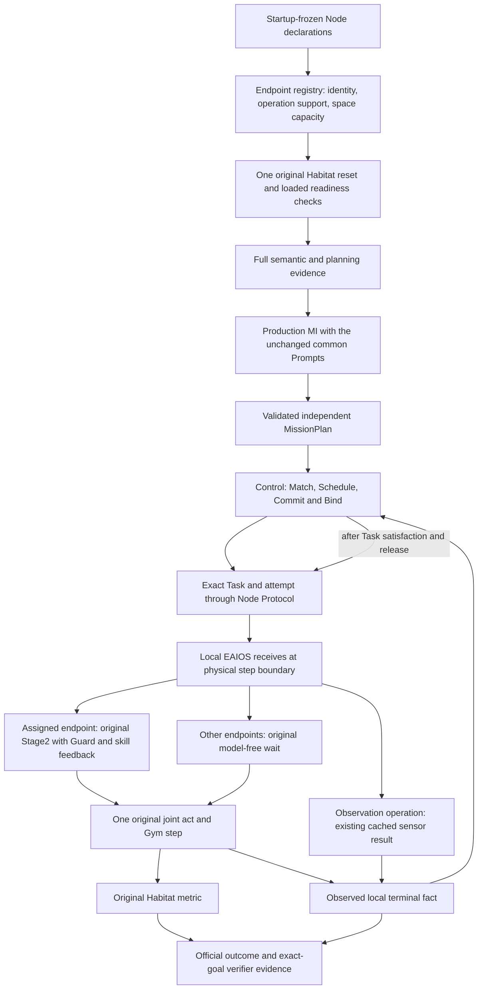

# Habitat independent live deployment

This opt-in Local EAIOS profile supports one to four registered endpoints in a
single original Habitat world. It accepts sparse independent dispatch and later
Control-owned Task reuse without waiting for an assignment on every endpoint.
The maintained templates cover Perception and a three-agent Rearrangement
candidate. See [ADR-0074](../decisions/0074-independent-live-endpoint-profile.md).



The arrows back to Control are observations, not adapter scheduling authority.
An observation receipt does not make a condition true; local completion does not
prove Task/Mission satisfaction. Official outcome comes only from Habitat.

## Frozen deployment and operation contracts

| Artifact | Version and purpose |
| --- | --- |
| `b1-deployment.json` | v0.3; endpoint config paths, original config/budget, relocation and observation flags |
| `endpoint-registry.json` | v0.1; exact Node sources, operation support, robot type, port, DB and exclusive resource |
| `preassignment-feasibility.json` | v0.5; full world identity plus explicit endpoint support; no new commitment authority |
| `relocation-episode-start.json` | v0.2 only for a relocator subset; actual objects, sources and relocator reset state |
| `local-how-profile.json` | v0.9; original base profile plus the explicit live deployment differences |
| `observation-<invocation-digest>.json` | local-condition-observation v0.1; cached detection receipt with exact attempt and scope |
| `live-session-state.json` | v0.1; local dispatch and terminal history, independent of official success |

Each operation requires the same endpoint's one capacity-one `space` slot and
local simulator lock. Control decides placement and releases ownership after
the Mission-declared Task satisfaction basis. There is no distinct-executor
constraint inferred from the number of goals. A Task has one Role in this profile;
at most 32 independent Tasks may reuse the configured endpoints. Simultaneous
local overlap and Actor migration reject, as do coupled Tasks and unsupported
continuation. A missing next assignment waits without stepping or calling a model
for the configured assignment-wait budget, then records an explicit failure.

Navigation retains its exact canonical destination and original chosen Local How.
Relocation retains exact object/source/destination, Guard, observed feedback and
the separately declared completion profile. Drone registration contains no
manipulation operation. Detection uses `observation.verify@v1` with exactly
`expected=detected(entity-ref)` for an admitted entity. It only queries whether the
already observed condition holds. A negative observation cannot satisfy an
affirmative detection goal. Missing/malformed data is unavailable. Global
detector observations are not attributed to one camera/agent. No active search,
camera motion or semantic goal rewrite is added.

## Native workload alignment

Perception uses original `llm_height_per.yaml` / `config_height_per.yaml`,
SpotRobot with its original head-jaw sensor variant and DJIDrone, the
`hssd_height_per.json.gz` dataset and unchanged 4,000-step limit. Its goal includes
both original navigation and detection predicates. Missing original robot-resume
files remain missing; loaded-class metadata does not synthesize a resume.

The Rearrangement candidate uses original `llm_multi_agent_mobility.yaml`,
SpotRobot/FetchRobot/DJIDrone, `mp3d_episodes_1.json.gz`, two object relocation
goals and unchanged 5,000-step limit. Its misleading “mobility” filename does not
make the goal navigation-only. The original README's Task4 filename
`llm_spot_drone_rearrange.yaml` is absent locally. Do not certify this candidate
as the paper's Task4 population until that mapping is resolved.

That candidate enables original random initialization and `w2j` reset output.
Declare the exact native JSON write target via the pair worker's
`vendor_writable_assets`; the driver makes its parent/target private per arm,
copies existing bytes when present, and gates original source digests. Never
let a batch reset write into shared vendor assets. Actual reset positions and
rotation must still match between paired arms; equal seed alone is insufficient.

## Preparation and release

Both templates use the common production B1 lifecycle and common MI Prompts;
no authored plan or historical source ID is injected. Prepare offline:

```bash
ROBOGUIDE_B1_PREPARE_ONLY=1 \
ROBOGUIDE_EMOS_ROOT=/absolute/verified/emos-source \
bash scenarios/e1-shared-world-perception/run-b1-roboguide.sh \
  /absolute/new/prepare-directory /absolute/frozen/input.json

ROBOGUIDE_B1_PREPARE_ONLY=1 \
ROBOGUIDE_EMOS_ROOT=/absolute/verified/emos-source \
bash scenarios/e1-shared-world-rearrangement/run-b1-roboguide.sh \
  /absolute/new/other-prepare-directory /absolute/frozen/candidate-input.json
```

Preparation starts no service, Provider or Habitat. It freezes workload identity,
renders two or three Nodes, preserves actual slots and builds exact source-bound
endpoint/recovery/spatial/relocation profiles. Consumed prepare directories cannot
be reused for execution. `roboguide-node --validate <file>` independently
checks rendered configs without registration or execution.

Before physical release freeze clean code SHA, built binaries, full vendor/module
and config identity, dataset digest, original budget, model `gpt-6.1-sol`, both API
paths, timeouts, diagnostics and distinct worker ports. The pair worker with v0.3
must include exactly its configured endpoint ports (`endpoint_a` through
`endpoint_d`, as applicable) plus proxy/grpc/controller/artifact/mission. Source
gates also cover Node files and planning/execution/service profiles. Current
navigation/Task3 workers keep their previous schemas and frozen views.

First release runs one preselected pair only after existing GPU queues free
capacity. Both actual reset snapshots, official outcome availability, operation
readiness, Task identity propagation, resource release and archival completeness
must be checked. Prepare-only, synthetic conformance and prior populations'
success cannot replace that physical gate. Then freeze a population and worker
configuration before batch dispatch; do not publish experiment files to Git.
Task4 additionally requires the mapping evidence above. This document does not
authorize changing native files, prompts, task semantics or benchmark metrics.
