# Habitat Local EAIOS 搬运操作执行 Profile

本页记录已实现并经过离线验证的 adapter 路径。Task3 部署注册和实际初始物体来源证据
与通用 B1 runner 接线已经实现并通过 deterministic tests。既有受控物理预检和工程批量已经运行，
但不能将本页、离线测试或某次成功当作正式配对实验已就绪的证明。

## Canonical What 与本地 How

Node 传递已有的 `object.relocate@v1`，保持 Mission/Task/Group/Role/attempt、资源承诺和
Execution Session。操作参数只有三个精确实体引用：`object`、`source`、`destination`。
它们不能携带厂商技能、坐标、物理机器人选择或控制命令。公共解析器校验 session identity、
slot 和 digest 后保留已解析的 metadata，不再把该对象当作原始 JSON 解析。

Local EAIOS 在显式 `--enable-relocation` 时映射这一操作到原始 EMOS Stage2 的工具和技能。
模型继续决定本地步骤；独立 Contract Guard 在原始 CrabAgent dispatch 前检查原始工具选择：

| 阶段 | 可以执行的操作 | 阶段转换依据 |
| --- | --- | --- |
| 尚未拾取 | 导航到精确 object、拾取精确 object、允许的 reset/wait/peer request | 原始 pick 技能被观察为完成 |
| 持有物体 | 导航到精确 destination、将精确 object 放至 destination、wait/peer request | 原始 place 技能被观察为完成 |
| 本地搬运完成 | 原始 wait 技能，不再选择新的模型动作 | 不再调用该 endpoint 的模型 |

被选中或工具 receipt 中出现 `Success` 均不能推进阶段。未观察到上一技能终态时，Guard
继续拒绝新的物理操作；预算耗尽、策略中断和未知不会被当作 pick/place 成功。
Guard 不替模型改目标、修改参数、补造动作或执行额外 step。

`source` 作为 canonical 请求的精确来源身份保留在执行及到达证据中。当前 Guard 约束工具
操作的对象和目的地及其已观察阶段；它没有新增现场来源位置验证器。部署必须提供可信的
物体来源证据，不能把保留参数等同于已经证明物体位于 source。

## Readiness 与启动边界

显式 shared relocation 的 `AgentArguments.robot_type` 来自冻结 Node profile，且已与实际
加载机器人逐个核对；原生 resume 中已提供的类型必须一致。缺失 resume 记录保持 unavailable，
不补造其能力描述，不修改 text context。`stage2-agent-identity.json` 保存来源 digest、
类型映射与缺失名单；导航默认路径不变。见 [ADR-0072](../decisions/0072-verified-stage2-agent-identity.md)。

默认仍只支持原有 navigation 操作，搬运开关关闭。开启时必须从所有实际加载的政策中读到
nav/pick/place 工具与已实例化、具备原始终止观测接口的 nav/pick/place/wait 技能。
readiness reader 支持原始 EMOS 的整数键 `_idx_to_name` / `_skills` 映射；它不调用技能、
模型或仿真接口。缺失或不可观测的技能会产生 unavailable，而不是从机器人名称推断能力。

完成后的 idle transition 还在执行合同安装时检查精确原始 `WaitSkillPolicy` 和两层技能索引。
这项检查在执行前完成。观测到原始 place 的成功终态时，才启用已经校验的临时 passive policy。
因此同一个 `actor.act()` 中随后进行的高层选择也不会再次询问已完成 endpoint 的模型。
段结束时恢复原始 agent 和方法 hooks；未分配 endpoint 继续沿用既有的 scoped idle 机制。

shared-world 支持已有的两种 independent topology：

- 两个 Actor、两个 endpoint，并发执行不同物体的操作；同一精确物体的并发搬运在 Stage2 前拒绝。
- 单个 Actor，在 Control/Orchestration 释放前一个 Task 后，在同一 endpoint 顺序执行后续 Task；
  保留同一次 reset 的世界、实际 observations 和累计步数，不替 Control 提前释放资源。

搬运不支持 cancelled-world continuation，也不能与现有 `any_at` 专用 goal-region navigation
profile 混用；开启这些组合会明确失败。没有基于实际抓持状态设计的恢复契约时，不会猜测
重试后的 holding phase。navigation 专用 floor feasibility 和 progress observer 对搬运保持
unknown/不发布，不能把到 destination 的距离当作整个搬运过程的进展。

## 本地终态与官方结果

搬运途中第一次导航结束，只更新该导航技能的反馈。只有原始 place 成功终态或原有的
官方成功终止路径，才允许该 endpoint 返回 `COMPLETED`。本地 place 完成以
`terminal_basis=relocation-place-skill` 记录；这不是官方 `at(object, destination)` 真值。
原始 place 的完成条件、技能预算、速度、路径、PDDL 定义及 `pddl_success` 全部保持原有权威。
这描述未开启下述独立 completion profile 的兼容路径；开启后本地观测与完成判断明确不同。
切入 wait 只表示不再下发新的模型动作，不能证明机器人或物体持续驻留；实际位姿与目标
真值仍需由已有诊断和官方 metric 观测。

局部完成和官方联合目标可以不一致。Verifier 继续只使用真实、严格 bool 的官方 metric，
绑定实际 Task/Role/attempt；无 metric 时不合成结果。Formal population 和 Mission satisfaction
规则没有因搬运 adapter 的接入而放宽。

## 可选的精确对象放置完成核验

`--relocation-completion-binding` 默认关闭，且只允许与 shared relocation 同时开启。
通用 B1 launcher 通过 `HABITAT_RELOCATION_COMPLETION_BINDING=1` 显式传递。
该 profile 不修改原始 EMOS 文件或 MI Prompt，但确实改变受控臂的本地观测/完成判断，
必须以 Local How v0.8 和 Stage2 feedback v0.4 披露，不能宣称与原生 EMOS 相同。
历史 feedback v0.3 保留其原始身份，不追溯改写。

原始 place 读取的共享 `targ_idx` 距离没有绑定本次搬运对象。新 profile 用 canonical
attempt、invocation digest、精确 object/destination 和该 agent 的实际 grasp 绑定观测，
保留原始严格 0.02m 条件，让原始 action 自己产生松手命令。技能完成另外要求物体已经
实际释放；“到达但仍在手里”不能完成。原有 Gym step 之后可核验最后预算一步的真实
释放，并保留该步之前的预算退出记录。没有新增 action、模型调用、Gym step、RNG 采样
或官方 predicate 查询。缺失、矛盾、跨 call/attempt/world 证据不能推进阶段。

启用时 reset_arm 可在前一个技能实际结束后、仍持有 canonical object 时执行；它不被
当作放置完成。模型可选择局部恢复，但 Guard 不主动补动作。导航工具 schema 与已观察
阶段一致：拾取前 object，持物时 destination；原始返回不被改写。关闭时保留旧路径。

新 `relocation-completion-readiness.json` 保存实际加载接口检查。稀疏 feedback 保存绑定、
distance、grasp、release eligibility、qualified completion 和可读时的 native sensor 对照。
只保留每 agent 的当前记录，沿用有界流式 audit，不新增每步序列化或磁盘写入。
见 [ADR-0073](../decisions/0073-bound-relocation-place-completion.md)。

### 搬运状态反馈与消息边界

启用对象绑定 profile 时，feedback v0.4 在工具接纳、原始技能退出和下一次模型调用边界
采集精确物体、实际 grasp、base position、末端 position 和原始 arm joint positions。
每份观察绑定当前 agent/attempt/invocation，标明采集时机；末端距离使用原始 PDDL entity
位置，不是接触距离或可抓取性证明。最多 64 个关节、每份观察最多 8 KiB；读取或
序列化失败保留 partial/unavailable。世界或对象身份改变后不读取其他世界的机械臂。
这些稀疏读取不调用 IK/FK、动作、RNG、predicate 或 Gym step；抓取预算耗尽仍然是失败，
没有由距离或失败次数推导出的不可达排除规则。

`roboguide.stage2-peer-execution-scope/v0.1` 描述同一执行段内各 peer 的现有 canonical
operation 和模型状态。`send_request` 是原始 message pipe 的文本通信，不是 Task 交接，
不改变 Control 的 Actor/Node/resource 承诺，也不扩大 peer 的物理操作权限。尚未完成的
peer 可以接收消息，但消息递送、接管或完成不能由一次 wait 的退出推出；receipt 将这些
结果保留为 unobserved/unknown。

原始工具 schema 的 recipient enum 只会收窄到当前仍有已分配模型的 peer；无可用 peer
时不提供该工具。未分配或完成后进入 passive idle 的 endpoint 不再接收新请求。即便模型
仍返回这样的 raw request，独立 Guard 也在 CrabAgent 派发和下一次 Gym step 前拒绝，
保留原始选择并报告 local contract failure。它不解析消息文本来自动转交任务、不补动作，
也不禁止合法 wait。真正跨执行任务的转交仍需要 Control 所有的重新承诺与生命周期机制，
本 profile 不实现该能力。关闭对象绑定 profile 时保留此前输入与工具路径。

```mermaid
flowchart LR
  D[Frozen B1 input 与显式部署声明] --> R[一次真实 reset 与技能 readiness]
  R --> P[新 run 的 neutral 来源与官方语义证据]
  P --> I[生产 Interpreter / Planner / Reviewer / Repairer]
  I --> C
  P --> A[版本化 operation admission：精确来源 / 配置容量 / route unknown]
  A --> C
  C[Control 已承诺的 canonical object/source/destination] --> E[Node 与 Execution Session]
  E --> G[本地精确工具契约]
  G --> M[原始 Stage2 模型选择]
  M --> V[Guard 校验原始选择]
  V --> S[原始 nav/pick/place 技能与唯一 Gym step]
  S --> F[技能终态反馈：原始路径或显式对象绑定 profile]
  E --> Q[可选 canonical 对象/抓持绑定]
  Q -->|精确距离，原始动作释放| S
  S -->|原有 step 后的位置与释放| Q
  Q --> F
  Q -->|稀疏机械臂与对象实际状态 / unknown| F
  F --> G
  F -->|place 本地完成| W[原始 wait / 完成 endpoint 无模型 idle]
  E --> P2[既有 peer canonical scope：通信不转交任务]
  W -->|completed-idle 不接收模型消息| P2
  P2 -->|对象绑定 profile 的 recipient schema 与 Guard| G
  F --> L[Node local outcome]
  S --> H[Habitat 官方联合目标与 pddl_success]
  H --> B[官方 benchmark 结果 / 既有 verifier]
```

这是当前 adapter 的实现图。对象绑定 profile 的新物理回归必须单独记录代码与启用配置，
不能将旧臂结果当作新臂的实验验证。

## 证据与限制

- `relocation-readiness.json`：实际加载技能的 readiness。
- endpoint durable invocation、`assignment-arrival.jsonl`、start-admission evidence：保留精确操作、
  object/source/destination、逻辑身份、资源和 session。
- `subtask-agent-*.txt`、`stage2-actions.jsonl`、`stage2-execution-feedback.jsonl`：实际传递的 subtask、
  未改写的工具选择和绑定原始 tool call 的技能反馈。
- 完成 endpoint 的 passive transition 记录 `roboguide.shared-world-idle-policy/v0.2`，
  `mode=passive-completed-endpoint`；原有未分配 idle evidence 继续使用 v0.1。
- 完成 endpoint 切入 passive wait 后，模型身份、调用次数和 token 统计继续引用该执行段的
  原始模型，退出时清除引用。单 Actor 多段的既有累计计数语义保持不变，不把 idle 的零调用
  覆盖成已经发生的模型调用数。
- action/feedback audit 保持流式、有界；idle 记录失败不改变执行结果，并使 feedback audit
  明确 incomplete。runtime source manifest 包含 guard、feedback、idle 与 readiness 模块身份。
- 共享世界 summary、endpoint local outcome、官方 verifier verdict 各自保留权威；采集失败
  不改变已经发生的物理结果。运行异常继续向上传播，已有异常退出诊断路径仍保存此前轨迹。

离线回归覆盖原始形状技能表、精确 session/tamper、原始方法一次调用、双 endpoint 和
单 Actor 顺序链、同物体冲突、错误目标、place budget、提前 episode 终止、取消、原始 Gym
异常、可选证据写入失败及实际 IPC 协议。IPC 测试在同进程线程中通过真实 pipe 执行原有
child entry / parent relay；没有加载 Habitat 或调用 Provider。

这些测试不能证明模型会稳定生成正确搬运序列、初始来源事实可靠、机器人能够完成抓放、
官方联合目标成立或成功率提高。进入固定小规模预检前还需用实际部署文件生成并核对
registration profile，审查冻结输入和 episode-start evidence，并取得真实物理预检授权；
保留原生 EMOS arm 与 controlled guard/feedback/idle 之间的差异，不改动历史结果。

## B1 部署接线与离线准备

Controller 的部署准入按 canonical operation 区分参数。导航仍使用原有 v0.3 负面候选
矩阵；显式搬运部署使用 `roboguide.deployment-intent-feasibility/v0.4`，在保留全部导航
记录的同时附带 neutral `operation_admission/v0.1`。搬运检查实际 reset 的 object/source、
destination 和配置 endpoint 身份，不将导航楼层判断当作搬运可达性；route 明确为 unknown。
共享拓扑、`space:1`、同物体并发限制，以及 Control 当前节点能力和资源承诺继续生效。
原始来源快照、注册配置与组合 digest 共同绑定持久候选约束；缺失和篡改会在启动检查中
失败。见 [ADR-0071](../decisions/0071-operation-aware-reset-admission.md)。

[`relocation runner`](../../scenarios/e1-shared-world-relocation/README.md) 复用现有 B1 入口，
通过严格版本化 `b1-deployment.json` 选择原始 `llm_height_man.yaml`、4,000 steps 和显式
搬运开关。导航部署仍使用原始 Spot/Fetch 配置和 3,000 steps；没有按 episode 硬编码分工。
配置的 Node ID 用于等待真实注册，不能从其他 Node 的诊断文本中误认注册完成。

新 run 保存 `b1-deployment-used.json`、`mission-config-used.toml`、run-local execution/planning
profile、registration snapshot 和现有 planning-source requirement。`PREPARE_ONLY=1` 在这些
文件准备完成后退出，早于端口访问、Conda、任何服务、reset 或 Provider 调用。它不是正式
运行，不生成 admission 或 benchmark 成绩，也不能复用该目录启动后续执行。

正常执行在实际 ONLINE 后、Controller/MI 前检查 `relocation-preflight.json`：精确
run/episode/scene/dataset/seed、一次 reset 的 step-zero 状态、真实技能 readiness、实际使用
的 Node snapshot 与发给 MI 的初始来源引用必须一致。检查失败保留原始证据，以 harness
证据检查失败明确归档；启动过程自身失败仍沿用既有 SUT failure 归因。两者均不伪造
`pddl_success` 或改动 Formal population 规则。

共享 endpoint 的只读恢复声明现覆盖导航和搬运三个操作，与真实部署文件一致；搬运保持
`execution-group` / `unsupported`。声明读取不调用世界、模型或 RNG，开启 cancelled-world
continuation 的不支持组合在启动阶段拒绝。这不授予新的 recovery permission。

运行期模块同时在部署的 Python 3.9.23 中验证了实际导入、canonical session round-trip、
契约阶段转换和 CLI help；这不加载仿真。运行期 type alias 使用 `typing.Union`，不能依靠
`from __future__ import annotations` 让模块级 `A | B` 赋值在 Python 3.9 中生效。该 Conda
环境没有 pytest；自动化回归在仓库 uv 管理的 Python 3.13 环境执行，不能把两者混称。
