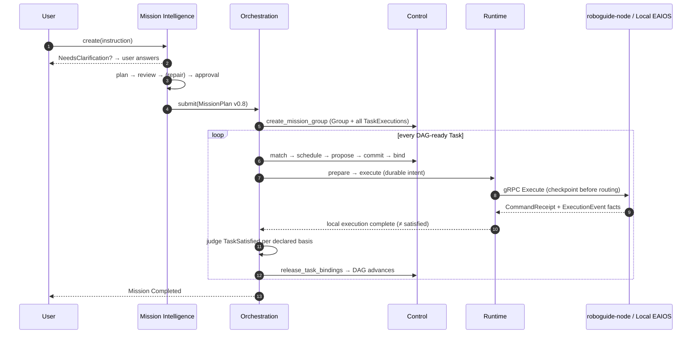
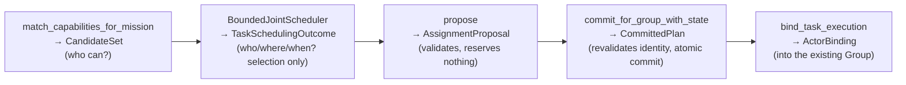

# Architecture tour

A reader-oriented introduction to the RoboGuide V2 architecture: how the system
is layered, how one instruction travels end to end, and which semantic
boundaries are deliberately frozen. The authoritative source is the in-repo
[V2 architecture baseline](docs/architecture/v2/index.md); this page reorganizes
the narrative without redefining its semantics.

## 1. Positioning

RoboGuide jointly schedules four resource kinds — **Capability** (provable
execution abilities), **Compute** (compute and model capacity), **Space**
(positions/routes/occupancy), and **Time** (windows/deadlines/intervals) —
without taking away node-local autonomy: perception, navigation, motion control,
and immediate safety (the Immediate How) always belong to Local Embodied Systems.

System-level coordination answers `What / Who / When / Shared Where`; the `How`
always stays local.

## 2. Layer map

| Layer | One-line responsibility | Authority | Code |
| --- | --- | --- | --- |
| Mission / Application | Provides external goals; never controls devices directly | — | consumers |
| [Mission Intelligence](modules/mission.md) | Text instruction → complete MissionPlan (clarify/review/approve loop) | Request/dialogue persistence, semantic admission | `mission/` |
| [Mission Orchestration](modules/orchestration.md) | Accepts the full MissionPlan, advances the DAG, judges Task/Mission terminal states | Mission lifecycle, satisfaction | `core/orchestration` |
| [Control Plane](modules/control.md) | Matching, scheduling, proposal, commit, binding, recovery | The only resource-commitment authority | `core/control` |
| [Distributed Runtime](modules/runtime.md) | Fact reduction of committed executions, attempt history, relations | Live execution state, fencing | `core/runtime` |
| [State & Memory Plane](modules/state.md) | Source-aware state records, projections, event log, Memory catalog | Evidence and projections (not a truth store) | `core/state` etc. |
| [Integration / Node](modules/integration-node-service.md) | Node Protocol v0.4 transport, node-side lifecycle, local integration engine | No execution-lifecycle authority | `core/integration` etc. |
| Local EAIOS | Deployment-side adapters for vendor/simulator systems | Immediate How, local safety | `integrations/` |

Dependency direction is one-way: `domain ← ports ← state/control/runtime/integration
← orchestration ← apps`. `core/orchestration` is the only crate combining
Control + Runtime + Integration + State (`IntegrationRuntimeBridge`) and is
therefore constrained to be a composition facade, never a second authority.

## 3. One instruction's complete journey

Using "move the cup from the living room to the kitchen" — the full sequence
first, then step by step:

**① Interpretation and clarification (Mission Intelligence).**
`MissionRequestEngine` captures an immutable, digest-bound
`GroundingContextSnapshot` (only deployment-approved World state records and
global Memory metadata — **never** live Node/Resource inventory); the
Interpreter produces a `GroundedIntent`; with blocking ambiguity it stays in
`NeedsClarification` until the user answers explicitly
([ADR-0038](docs/decisions/0038-blocking-clarification-and-grounding-acquisition.md)).

**② Plan, review, repair, approve.**
The Planner may only reference known Canonical Capability Catalog contracts to
produce an acyclic Task Graph; the Reviewer independently returns structured
issues, Repair is bounded (at most twice), and questions requiring new user
facts go back to clarification instead of being guessed
([ADR-0032](docs/decisions/0032-mission-review-and-repair-loop.md); config
`max_repair_attempts`). Risky drafts enter `AwaitingApproval` as decided by the
`ApprovalPolicy`.

**③ Submission and acceptance.**
`HttpMissionController.submit_plan` delivers MissionPlan v0.8 to the Controller;
on the Orchestration side `MissionOrchestrator::submit` validates the mechanism
profile and timing anchor, then **Control** creates the Mission-level Execution
Group with all TaskExecutions.

**④ Scheduling front half (Control).**
Each ready Task walks the full chain — every step a separate API with separate
authority:

Scheduling decisions may come back as `SelectedNow / SelectedFuture / Deferred /
WindowMissed`; shortages are recorded as typed, persisted, per-Task deduplicated
deferrals — **one Mission's resource shortage never stalls another Mission's
timer** ([ADR-0041](docs/decisions/0041-core-scheduling-disposition.md)).

**⑤ Dispatch and node execution.**
`IntegrationRuntimeBridge` creates a durable dispatch intent (checkpoint before
routing) and sends it over gRPC Node Protocol v0.4 to the target node's
`roboguide-node`. The node's Local Integration Engine maps the canonical
`ExecutionIntent` to its local How (config-declared HTTP/gRPC/MCP workflows);
progress flows back as immutable `ExecutionEvent` facts. A `CommandReceipt`
only proves the Node journal durably accepted the command — it is **not** an
execution result
([ADR-0028](docs/decisions/0028-durable-command-recovery-and-attempts.md)).

**⑥ Reduction and satisfaction.**
Runtime reduces execution facts per logical slot `(GroupId, TaskRef, RoleId)`
and keeps an immutable attempt history; Orchestration consumes the facts and,
when the Mission-declared `satisfaction.basis` (execution-report or
verifier-evidence) is met, records `TaskSatisfied`, releases Task-scoped
bindings, and advances the DAG; when all Tasks are satisfied the Mission ends
([ADR-0033](docs/decisions/0033-task-satisfaction-boundary.md)).

## 4. Invariants

The V2 baseline explicitly freezes the following semantics; neither
implementation nor documentation may rewrite them:

- **Proposal and Commit are distinct**; an uncommitted proposal never
  constitutes a resource allocation.
- **Execution completion ≠ semantic satisfaction**; neither equals a single
  adapter call's return value.
- **Local Safety cannot be overridden remotely**; recovery must re-reconcile
  against the current world and never replays stale commands.
- **State is not Global Truth**: records keep source/channel/receive-time,
  independent sources never overwrite each other, and Observations are never
  auto-promoted to Belief.
- **Memory is separate from live State**: Scope / Visibility / Placement are
  independent dimensions; the catalog stores metadata and replica evidence
  only, never payload bytes.
- **Relation endpoints are logical `(TaskId, RoleId)` slots**, not NodeIds;
  rebind never changes Mission semantics.
- **`Unknown` means recovery-pending, not failure**: non-terminal attempts
  after restart/route loss enter Unknown and the recovery flow — physical
  actions are never blindly replayed.

## 5. Recovery ladder

Recovery escalates only to the minimum level needed to finish the task:

| Level | Owner | Handling |
| --- | --- | --- |
| L0 | Local Autonomy | obstacle avoidance, short-horizon replanning, safe stop |
| L1 | Runtime | reconnect, restore invocation/communication |
| L2 | Execution Group | member replacement, rebind (Control authority) |
| L3 | Scheduler / Coordination | re-Propose → Commit |
| L4 | Mission Intelligence | replan when the Task Graph can no longer satisfy the Mission |

The Control side of L2 is an explicit five-step pipeline: `assess_group →
begin_role_recovery → match_recovery_candidates → (scheduler) →
propose_role_recovery → commit_role_recovery → rebind_role`; an uncommitted
recovery proposal creates no reservation
([ADR-0004](docs/decisions/0004-recovery-commitment-lifecycle.md)).

## 6. Coordination: runtime constraints beyond the DAG

The Task DAG expresses completion prerequisites, not continuously-held
constraints between two running executions. A MissionPlan's `CoordinationContext`
declares Execution Coordination Relations whose endpoints are `(TaskId, RoleId)`
logical slots; the current executable profile opens exactly two:

- `requires-active`: while the target execution is active, the source execution
  must remain active;
- `shared-spatial-reference`: strong localization evidence must match the
  current attempt / owner / immutable map revision / frame.

Runtime reduces relations to `Dormant / Pending / Satisfied / Violated /
Unknown`; `Violated/Unknown` raise a fence that requires explicit confirmation
to clear even after the relation becomes satisfied again. Other typed relation
syntaxes are rejected by the implementation preflight before Group creation
rather than lingering as indefinite `Unknown`
([ADR-0020](docs/decisions/0020-execution-coordination-relations.md),
[ADR-0027](docs/decisions/0027-runtime-coordination-evidence-completion.md)).

## 7. Versions and open questions

See the [version snapshot](index.md#version-snapshot) on the homepage. V2
deliberately keeps seven open architecture questions (State Authority, Spatial
Authority, Control Topology, Execution Group Authority, Scheduling vs Runtime
Coordination, Temporal Assurance, Resource Commitment Semantics); the tracking
list lives in [implementation-backlog.md](docs/implementation-backlog.md).

Going deeper: layer details in the [module maps](modules/domain-ports.md); the
reasoning behind every semantic in the [ADR index](docs/decisions/index.md).
