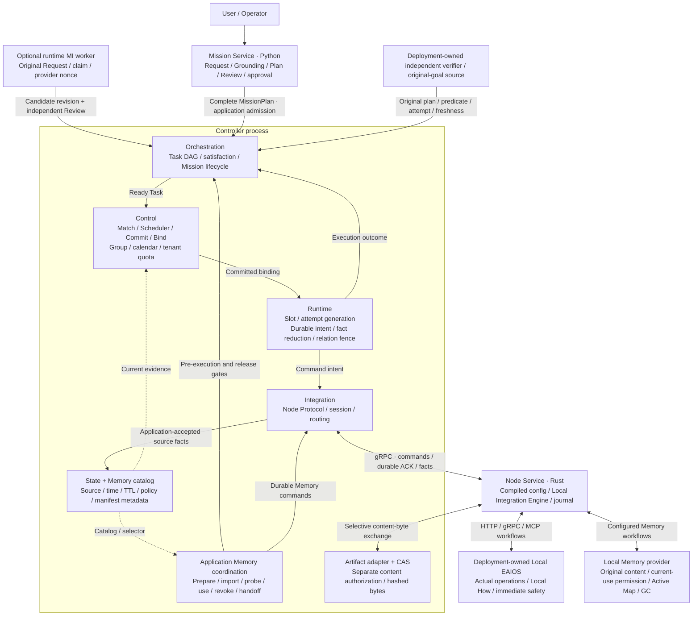

# Architecture tour

Keep three views separate: logical architecture explains responsibility, code modules locate implementation, and deployment topology identifies actual processes. The [V2 architecture handbook](docs/architecture/v2/architecture-handbook.md) develops all three.

## Purpose

RoboGuide coordinates Capability, Compute, Space and Time around a long-lived Mission. Global coordination handles objectives, resources and collaboration constraints; Local EAIOS retains Local How and final safety.

## Layers and authority

| Layer | Decision authority | Read more |
| --- | --- | --- |
| MI | Interpretation, clarification, planning, Review and approval | [Mission Intelligence](modules/mission.md) |
| Orchestration | Complete-plan acceptance, DAG, satisfaction and Mission completion | [Orchestration](modules/orchestration.md) |
| Control | Eligibility, resource commitment, binding, Groups and recovery decisions | [Control](modules/control.md) |
| Runtime | Current attempts, durable intents, fact reduction and relation fences | [Runtime](modules/runtime.md) |
| Integration / Node | Formal transport, Node journal and local workflows | [Nodes and protocol](modules/integration-node-service.md) |

State, Memory, identity and persistence span these responsibilities; they are not a final serial processing stage.

## Current code architecture

Reviewed against mainline code on 2026-10-22. Controller modules share application transactions;
State, Memory and verification support the execution chain horizontally.

<!-- architecture-overview:start -->

```mermaid
flowchart TB
  %% roboguide:min-width: 1280px
  U[User / Operator] --> MI[Mission Service · Python<br/>Request / Grounding / Plan / Review / approval]
  MW[Optional runtime MI worker<br/>Original Request / claim / provider nonce] -->|Candidate revision + independent Review| O
  MI -->|Complete MissionPlan · application admission| O

  subgraph CTRL[Controller process]
    O[Orchestration<br/>Task DAG / satisfaction / Mission lifecycle]
    C[Control<br/>Match / Scheduler / Commit / Bind<br/>Group / calendar / tenant quota]
    R[Runtime<br/>Slot / attempt generation<br/>Durable intent / fact reduction / relation fence]
    I[Integration<br/>Node Protocol / session / routing]
    O -->|Ready Task| C
    C -->|Committed binding| R
    R -->|Command intent| I
    R -->|Execution outcome| O
    S[State + Memory catalog<br/>Source / time / TTL / policy / manifest metadata]
    M[Application Memory coordination<br/>Prepare / import / probe / use / revoke / handoff]
    A[Artifact adapter + CAS<br/>Separate content authorization / hashed bytes]
    I -->|Application-accepted source facts| S
    S -.Current evidence.-> C
    S -.Catalog / selector.-> M
    M -->|Pre-execution and release gates| O
    M -->|Durable Memory commands| I
  end

  I <-->|gRPC · commands / durable ACK / facts| N[Node Service · Rust<br/>Compiled config / Local Integration Engine / journal]
  N <-->|HTTP / gRPC / MCP workflows| L[Deployment-owned Local EAIOS<br/>Actual operations / Local How / immediate safety]
  N <-->|Configured Memory workflows| P[Local Memory provider<br/>Original content / current-use permission / Active Map / GC]
  N <-->|Selective content-byte exchange| A
  V[Deployment-owned independent verifier / original-goal source] -->|Original plan / predicate / attempt / freshness| O
```
<!-- architecture-overview:end -->

The [complete Mermaid architecture atlas](docs/architecture/v2/current-architecture.en.md) contains
execution/durability, process/storage and Habitat/Eval views, plus a code evidence table and downloadable sources.
Zero Nodes is valid. A Node is not a Host; Replica metadata consensus, content recovery and physical continuity
remain separate. The old V2 PNG is a historical conceptual snapshot.

## Invariants

- Proposals create no reservations; Commit rechecks current evidence.
- Control manages Groups; Runtime carries execution context. Releasing a Task does not destroy its Group.
- Local Completed does not automatically mean TaskSatisfied. Unknown retains ambiguity and ownership.
- State preserves source, receive time and TTL without silently merging independent sources.
- Memory Scope, Visibility and Placement are independent. A CAS reference does not establish receiver import.
- Recovery preserves original facts, budgets and permission. Local EAIOS and independent evidence constrain device safety.

## Continue reading

[Concepts](concepts.md) explains identities; [Lifecycle](lifecycle.md) follows normal and failure paths; [State and Memory](state-memory.md) covers evidence and content; [Status](status.md) records implementation limits.
