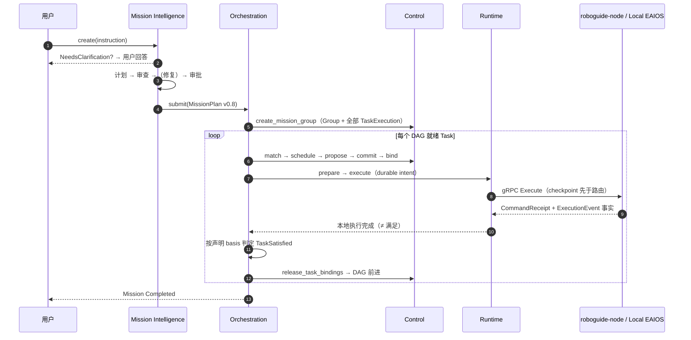
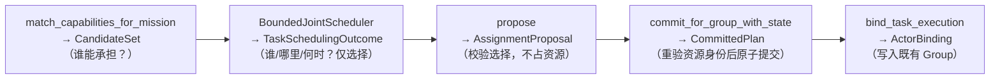

# 架构导览

本页是读者视角的 RoboGuide V2 架构入门：系统如何分层、一条指令如何走完全程、
哪些语义边界被刻意冻结。架构权威源是仓库内的
[V2 架构基线](docs/architecture/v2/index.md)；本页不改写其语义，只重组叙述顺序。

## 1. 系统定位

RoboGuide 联合调度四类资源——**Capability**（可证明的执行能力）、**Compute**
（算力与模型容量）、**Space**（位置/路线/占用）、**Time**（窗口/截止/占用区间）——
同时不夺走节点的本地自治：感知、导航、运动控制与即时安全（Immediate How）
始终属于 Local Embodied Systems。

系统级协调回答 `What / Who / When / Shared Where`；`How` 永远留在本地。

## 2. 分层地图

| 层 | 一句话职责 | 关键权威 | 代码 |
| --- | --- | --- | --- |
| Mission / Application | 提供外部目标，不直接控制设备 | —— | 使用方 |
| [Mission Intelligence](modules/mission.md) | 文本指令 → 完整 MissionPlan（含澄清/审查/审批闭环） | Request/dialogue 持久化、语义接纳 | `mission/` |
| [Mission Orchestration](modules/orchestration.md) | 接纳完整 MissionPlan，推进 DAG，判定 Task/Mission 终态 | Mission 生命周期、满足判定 | `core/orchestration` |
| [Control Plane](modules/control.md) | 匹配、调度、提案、提交、绑定、恢复 | 唯一资源承诺权威 | `core/control` |
| [Distributed Runtime](modules/runtime.md) | 已提交执行的事实归约、尝试历史、协同关系 | 活执行状态、fencing | `core/runtime` |
| [State & Memory Plane](modules/state.md) | 源感知状态记录、投影、事件日志、Memory Catalog | 证据与投影（非真相存储） | `core/state` 等 |
| [Integration / Node](modules/integration-node-service.md) | Node Protocol v0.4 传输、节点侧生命周期与本地集成引擎 | 无执行生命周期权威 | `core/integration` 等 |
| Local EAIOS | 厂商/仿真系统的部署侧适配 | Immediate How、本地安全 | `integrations/` |

依赖方向是单向的：`domain ← ports ← state/control/runtime/integration ← orchestration ← apps`。
`core/orchestration` 是唯一同时组合 Control + Runtime + Integration + State 的 crate
（`IntegrationRuntimeBridge`），它也因此被约束为组合门面而非第二权威。

## 3. 一条指令的完整旅程

以"让机器人把客厅的杯子拿到厨房"为例，先看全链路时序，再逐步展开：

**① 解释与澄清（Mission Intelligence）。**
`MissionRequestEngine` 捕获一份不可变、digest 绑定的 `GroundingContextSnapshot`
（只含部署批准的 World 状态记录与全局 Memory 元数据，**绝无** live Node/Resource
inventory），Interpreter 产生 `GroundedIntent`；存在阻塞性歧义时停在
`NeedsClarification`，由用户显式回答（[ADR-0038](docs/decisions/0038-blocking-clarification-and-grounding-acquisition.md)）。

**② 计划、审查、修复、审批。**
Planner 只能引用 Canonical Capability Catalog 的已知 contract 生成无环 Task
Graph；Reviewer 独立返回结构化问题，Repair 有界执行（最多两次），需要新用户
事实的问题回到澄清而不是猜测（[ADR-0032](docs/decisions/0032-mission-review-and-repair-loop.md)；
配置 `max_repair_attempts`）。风险草案进入 `AwaitingApproval`，由
`ApprovalPolicy` 决定是否需要人工。

**③ 提交与接纳。**
`HttpMissionController.submit_plan` 把 MissionPlan v0.8 递交给 Controller；
Orchestration 侧 `MissionOrchestrator::submit` 校验机制 profile 与时间锚点后，
由 **Control** 创建 Mission-level Execution Group 与全部 TaskExecution。

**④ 调度前半程（Control）。**
就绪 Task 走完整链条，每步是独立 API、独立权威：

调度决策可能是 `SelectedNow / SelectedFuture / Deferred / WindowMissed`；
不足被记录为 typed、持久化、按 Task 去重的 deferral——**一个 Mission 的资源
短缺不会拖停其他 Mission 的定时器**（[ADR-0041](docs/decisions/0041-core-scheduling-disposition.md)）。

**⑤ 派发与节点执行。**
`IntegrationRuntimeBridge` 生成 durable dispatch intent（checkpoint 先于路由），
经 gRPC Node Protocol v0.4 送至目标节点的 `roboguide-node`。节点的
Local Integration Engine 把 canonical `ExecutionIntent` 映射为本地 How（配置声明的
HTTP/gRPC/MCP workflow），执行进度以不可变 `ExecutionEvent` 事实回流。
命令回执（`CommandReceipt`）只证明 Node journal 已持久接受命令，**不是**执行结果
（[ADR-0028](docs/decisions/0028-durable-command-recovery-and-attempts.md)）。

**⑥ 归约与满足。**
Runtime 按逻辑槽 `(GroupId, TaskRef, RoleId)` 归约执行事实，维护不可变尝试历史；
Orchestration 消费事实，在 Mission 声明的 `satisfaction.basis`（execution-report
或 verifier-evidence）满足时记录 `TaskSatisfied`、释放 Task 级绑定、推进 DAG，
全部 Task 满足后结束 Mission（[ADR-0033](docs/decisions/0033-task-satisfaction-boundary.md)）。

## 4. 不变量

以下语义被 V2 基线显式冻结，实现与文档都不允许改写：

- **Proposal 与 Commit 区分**；未提交提案绝不构成资源分配。
- **执行完成 ≠ 语义满足**；两者也都不等于单次 adapter 调用返回值。
- **Local Safety 不可被远程覆盖**；恢复不得重放过期命令，必须针对当前世界重新对账。
- **State 不是 Global Truth**：记录保留 source/channel/receive-time，独立来源不互相覆盖，
  Observation 不自动升级为 Belief。
- **Memory 与实时 State 分离**：Scope / Visibility / Placement 三维独立，Catalog
  只保存元数据与副本证据，从不保存 payload bytes。
- **协同关系端点是逻辑 `(TaskId, RoleId)` 槽**，不是 NodeId；rebind 不改变 Mission 语义。
- **`Unknown` 是恢复待定，不是失败**：重启/丢路由后的非终态尝试进入 Unknown 与
  恢复流程，绝不盲目重放物理动作。

## 5. 恢复阶梯

恢复只升级到完成任务所需的最低层级：

| 层级 | 所有者 | 处理方式 |
| --- | --- | --- |
| L0 | Local Autonomy | 避障、短程重规划、安全停机 |
| L1 | Runtime | 重连、恢复调用/通信 |
| L2 | Execution Group | 成员替换、rebind（Control 权威） |
| L3 | Scheduler / Coordination | 重新 Propose → Commit |
| L4 | Mission Intelligence | Task Graph 无法满足 Mission 时重新规划 |

L2 的 Control 侧实现是显式五步管道：`assess_group → begin_role_recovery →
match_recovery_candidates → (scheduler) → propose_role_recovery →
commit_role_recovery → rebind_role`，未提交的恢复提案不产生任何预约
（[ADR-0004](docs/decisions/0004-recovery-commitment-lifecycle.md)）。

## 6. 协同：DAG 之外的运行时约束

Task DAG 表达"完成的前置"，不表达"两个正在运行的执行之间持续成立的约束"。
MissionPlan 的 `CoordinationContext` 声明 Execution Coordination Relation，
端点是 `(TaskId, RoleId)` 逻辑槽；当前可执行 profile 只开放两种：

- `requires-active`：目标执行活跃期间，源执行必须保持活跃；
- `shared-spatial-reference`：强定位证据必须匹配当前 attempt / owner / 不可变
  地图 revision / frame。

Runtime 把关系归约为 `Dormant / Pending / Satisfied / Violated / Unknown`；
`Violated/Unknown` 形成 fence，即使关系恢复也需显式确认解除。其余 typed
relation 语法会在 Group 创建前的实现预检中被拒绝，而不是无限期 `Unknown`
（[ADR-0020](docs/decisions/0020-execution-coordination-relations.md)、
[ADR-0027](docs/decisions/0027-runtime-coordination-evidence-completion.md)）。

## 7. 版本关系与开放问题

当前版本快照见[首页](index.md#版本快照)。V2 有意保留七个开放架构问题
（State Authority、Spatial Authority、Control Topology、Execution Group
Authority、Scheduling vs Runtime Coordination、Temporal Assurance、Resource
Commitment Semantics），跟踪列表在
[implementation-backlog.md](docs/implementation-backlog.md)。

深入阅读：各层细节进[模块地图](modules/domain-ports.md)；每条语义的决策理由查
[ADR 索引](docs/decisions/index.md)。
