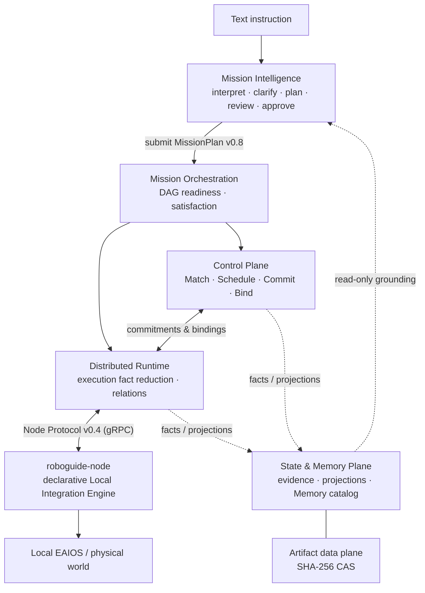

# RoboGuide Technical Docs

**RoboGuide** is a general-purpose distributed operating system framework for
heterogeneous embodied agents (DEAIOS — Distributed Embodied AI OS). It jointly
schedules **Capability / Compute / Space / Time** while leaving perception,
navigation, motion control, and immediate safety to each node's local autonomy.

RoboGuide is not just a scheduler: it defines the complete boundaries of resource
abstraction, shared state, task and execution lifecycles, distributed invocation,
coordination constraints, and recovery semantics — each frozen point by point in
[47 Architecture Decision Records (ADRs)](docs/decisions/index.md).

!!! info "Project status"

    RoboGuide is under active development. The V2 architecture baseline and the
    first core semantic chains are implemented and fully covered by offline
    deterministic tests; the complete MVP (including real-robot acceptance and
    the full State & Memory Plane) is not finished yet. Per-module status is
    documented in the "Implementation status" sections of the
    [module maps](modules/domain-ports.md).

## Core ideas

The system is built around three recurring semantic separations:

| Separation | Meaning |
| --- | --- |
| **Proposal ≠ Commit** | A scheduling choice is only a proposal; only Control's atomic Commit makes resource obligations effective and observable in Allocation State |
| **Execution complete ≠ Satisfied** | Runtime-reduced local execution completion and Orchestration's Task satisfaction (judged against the Mission-declared basis) are two different facts |
| **Logical identity ≠ Physical identity** | Mission Actors / Roles / relation endpoints are logical slots; Nodes, PhysicalEntities, and Local EAIOS are deployment-owned physical identities, with bindings persisted explicitly by Control |

More frozen invariants: [architecture tour](architecture-tour.md#invariants).

## System composition

| Layer | Responsibility | Code | Docs |
| --- | --- | --- | --- |
| Mission Intelligence | Text instruction → clarification → plan → review → approval → submission | `mission/` (Python, 32 modules) | [module map](modules/mission.md) |
| Orchestration | Full MissionPlan acceptance, DAG readiness, typed scheduling, satisfaction | `core/orchestration` (Rust) | [module map](modules/orchestration.md) |
| Control Plane | Matching, bounded joint scheduling, proposal/commit, Group lifecycle, recovery | `core/control` (Rust) | [module map](modules/control.md) |
| Runtime | Live execution registry, attempt history, relation reduction, recovery fencing | `core/runtime` (Rust) | [module map](modules/runtime.md) |
| State & Memory | Source-aware state records, projections, event log, Memory catalog | `core/state` + `core/artifact-store` | [module map](modules/state.md) |
| Domain values & ports | Cross-authority shared domain values, transport-neutral port contracts | `core/domain` + `core/ports` | [module map](modules/domain-ports.md) |
| Integration / Node | Node Protocol v0.4 transport, node service, local integration engine | `core/integration` + `core/node-service` + `apps/` | [module map](modules/integration-node-service.md) |
| Eval Harness | Independent experiment orchestration, evidence reduction, reproducibility infra | `evaluation/` (Python) | [module map](modules/evaluation.md) |

## Where to start

- **[Getting started](getting-started.md)** — prerequisites, build, tests, and three runnable demo paths
- **[Architecture tour](architecture-tour.md)** — reader-oriented layers, one instruction's full journey, recovery ladder
- **[Module maps](modules/domain-ports.md)** — responsibility, key types, main flows, and implementation status of every crate/package (grounded in code facts)
- **[Architecture Decision Records](docs/decisions/index.md)** — full index of all 47 ADRs
- **[V2 architecture baseline](docs/architecture/v2/index.md)** — mirrored in-repo source of truth

## Version snapshot

| Contract | Current version |
| --- | --- |
| MissionPlan | `roboguide.mission-plan/v0.8` (v0.2–v0.7 compatible input) |
| Node Protocol (wire) | `roboguide.node-protocol/v0.4` |
| Node Contract (semantic) | `roboguide.node.v0.6` (v0.4/v0.5 compatible) |
| Node Config | `roboguide.node-config/v0.7` (v0.2–v0.6 compatible) |
| Canonical Capability Catalog | `capability-catalog/v0.3` |
| Controller checkpoint | `roboguide.controller-checkpoint/v17` |
