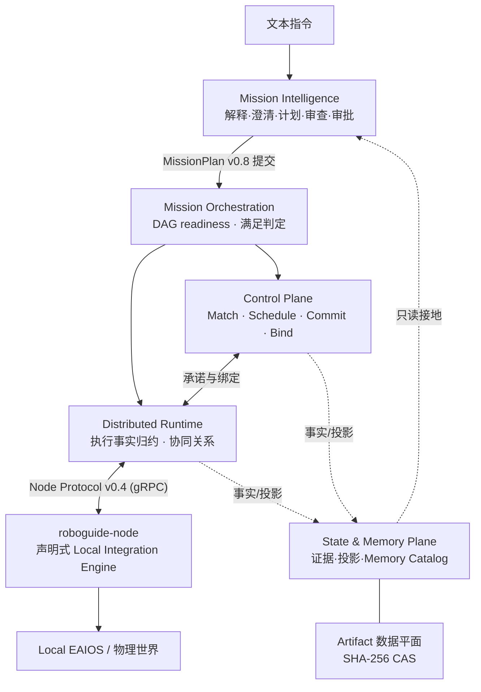

# RoboGuide 技术文档

**RoboGuide** 是面向异构具身智能体协作的通用分布式操作系统框架（DEAIOS，
Distributed Embodied AI OS）。它联合调度 **Capability / Compute / Space / Time**
四类资源，同时把感知、导航、运动与即时安全保留给每个节点的本地自治。

RoboGuide 不只是一个 Scheduler：它定义资源抽象、共享状态、任务与执行生命周期、
分布式调用、协同约束与恢复语义的完整边界，并通过 [47 份架构决策记录（ADR）](docs/decisions/index.md)
逐条冻结这些语义。

!!! info "项目状态"

    RoboGuide 正在积极开发中。V2 架构基线与首批核心语义链已实现并全部由
    离线确定性测试覆盖；完整 MVP（含真机验收、完整 State & Memory Plane）
    尚未完成。各模块的精确实现状态见[模块地图](modules/domain-ports.md)各页的"实现状态"章节。

## 核心思想

整个系统围绕三个反复出现的语义分离构建：

| 分离 | 含义 |
| --- | --- |
| **Proposal ≠ Commit** | 调度选择只是提案；只有 Control 的原子 Commit 才让资源义务生效并可在 Allocation State 中观察 |
| **执行完成 ≠ 语义满足** | Runtime 归约的本地执行结束（execution completion）与 Orchestration 依据 Mission 声明的 basis 判定的 Task 满足（satisfaction）是两个不同事实 |
| **逻辑身份 ≠ 物理身份** | Mission Actor / Role / 协同关系端点是逻辑槽位；Node、PhysicalEntity、Local EAIOS 是部署拥有的物理身份，绑定关系由 Control 显式持久化 |

更多已冻结不变量见[架构导览](architecture-tour.md#不变量)。

## 系统组成

| 层 | 职责 | 代码 | 文档 |
| --- | --- | --- | --- |
| Mission Intelligence | 文本指令 → 澄清 → 计划 → 审查 → 审批 → 提交 | `mission/`（Python，32 模块） | [模块地图](modules/mission.md) |
| Orchestration | 完整 MissionPlan 接纳、DAG 就绪、Typed 调度、满足判定 | `core/orchestration`（Rust） | [模块地图](modules/orchestration.md) |
| Control Plane | 匹配、有界联合调度、提案/提交、Group 生命周期、恢复 | `core/control`（Rust） | [模块地图](modules/control.md) |
| Runtime | 活执行注册表、尝试历史、协同关系归约、恢复 fencing | `core/runtime`（Rust） | [模块地图](modules/runtime.md) |
| State & Memory | 源感知状态记录、投影、事件日志、Memory Catalog | `core/state` + `core/artifact-store` | [模块地图](modules/state.md) |
| Domain 值与端口 | 跨权威共享领域值、传输中立端口契约 | `core/domain` + `core/ports` | [模块地图](modules/domain-ports.md) |
| Integration / Node | Node Protocol v0.4 传输、节点服务、本地集成引擎 | `core/integration` + `core/node-service` + `apps/` | [模块地图](modules/integration-node-service.md) |
| Eval Harness | 独立实验编排、证据归约、可复现性基础设施 | `evaluation/`（Python） | [模块地图](modules/evaluation.md) |

## 从哪里开始

- **[快速开始](getting-started.md)** —— 环境、构建、测试，以及三条可运行的演示路径
- **[架构导览](architecture-tour.md)** —— 读者视角的分层语义、一个任务的完整旅程、恢复阶梯
- **[模块地图](modules/domain-ports.md)** —— 每个 crate / 包的职责、关键类型、主流程与实现状态（基于代码事实）
- **[架构决策记录](docs/decisions/index.md)** —— 47 份 ADR 全索引
- **[V2 架构基线](docs/architecture/v2/index.md)** —— 仓库内架构 source of truth 的镜像

## 版本快照

| 契约 | 当前版本 |
| --- | --- |
| MissionPlan | `roboguide.mission-plan/v0.8`（v0.2–v0.7 兼容输入） |
| Node Protocol（wire） | `roboguide.node-protocol/v0.4` |
| Node Contract（语义） | `roboguide.node.v0.6`（v0.4/v0.5 兼容） |
| Node Config | `roboguide.node-config/v0.7`（v0.2–v0.6 兼容） |
| Canonical Capability Catalog | `capability-catalog/v0.3` |
| Controller checkpoint | `roboguide.controller-checkpoint/v17` |
