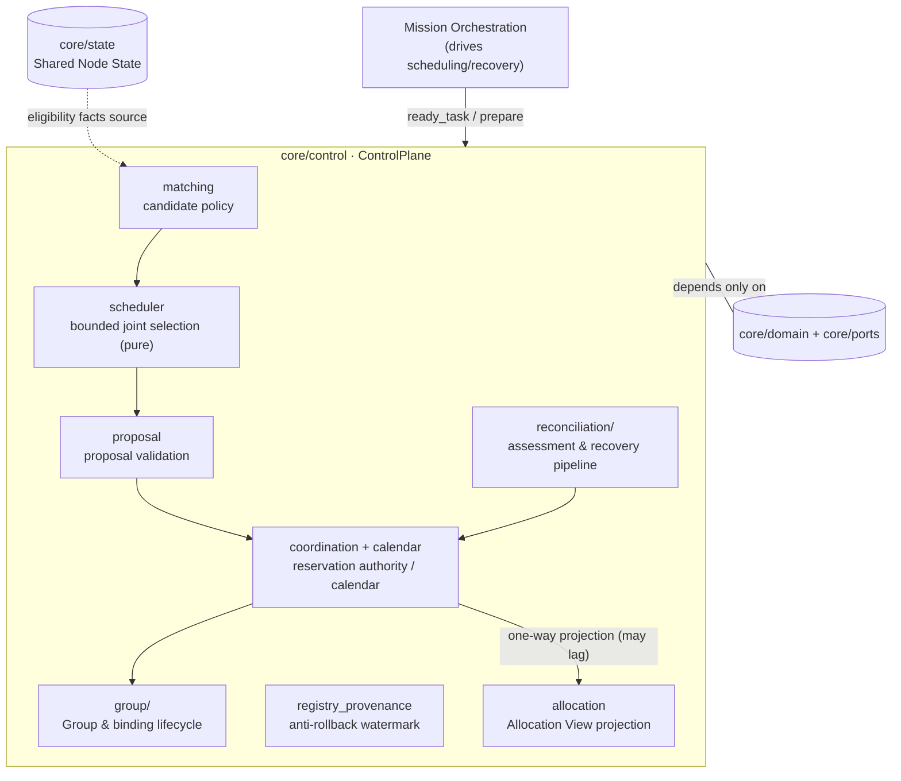
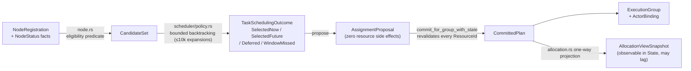
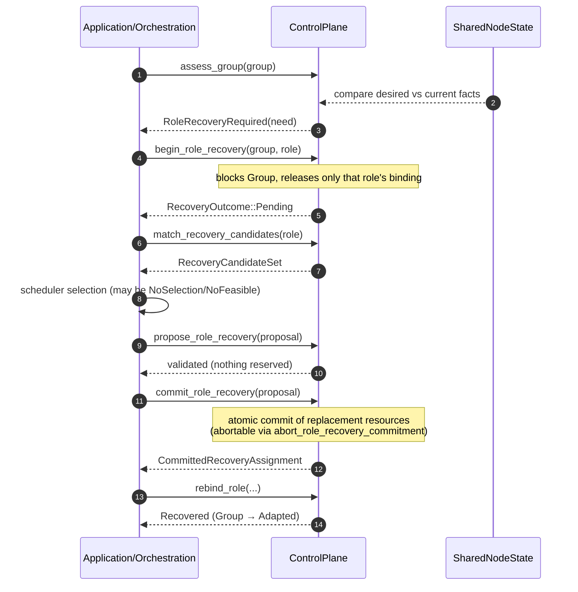

# Module map: Control Plane

Crate: [`core/control`](https://github.com/Farewell-CK/RoboGuide/tree/main/core/control)
(~8,200 LOC production + ~8,600 LOC tests; 18 production modules, 123 test
functions). Module map home · Previous: [Domain & ports](domain-ports.md) ·
Next: [Orchestration](orchestration.md)

**Position** (lib.rs): Control Plane facade and composition root. The in-process
authoritative `ControlPlane` holds: node lease authority, the unique resource
reservation authority, the future-task scheduling calendar, mission-scoped Actor
binding authority, the deployment entity registry with anti-rollback provenance,
Execution Groups, and pending recovery commitments.

## Position in the architecture

Control is the only resource-commitment authority — driven by Orchestration,
observed by State, doing no transport and interpreting no execution intents:



## Authority boundary

| Control owns | Control never does |
| --- | --- |
| Resource Commit/Revoke (the only reservation authority) | Interpreting ExecutionIntent objectives/parameters |
| Group lifecycle and Rebind decisions | Transport (belongs to integration) |
| Recovery commitments (pending commitments) | Choosing replacement candidates (consumes external proposals) |
| Scheduling calendar and versioned snapshots | Holding State truth (Allocation is only a projection) |
| Actor/physical-entity binding persistence | Reducing execution facts (Runtime's job) |

## Data flow

How scheduling data flows through and around Control (every step a distinct,
auditable type):



## Normal-path sequence

The full call chain from DAG-ready to Group binding (every arrow is a real
public API):

```mermaid
sequenceDiagram
    autonumber
    participant O as MissionOrchestrator
    participant C as ControlPlane
    participant S as BoundedJointScheduler
    participant St as SharedNodeState

    O->>C: create_mission_group(plan)
    C-->>O: ExecutionGroupId + all TaskExecutions
    O->>C: ready_task_execution(task)
    O->>C: match_capabilities_for_mission(task)
    St-->>C: current eligibility facts
    C-->>O: CandidateSet
    O->>S: schedule_task(candidates, snapshot)
    S-->>O: SelectedNow(TaskSchedulingDecision)
    Note over S: stateless deterministic backtracking;<br/>no validation, no commit, no mutation
    O->>C: propose(AssignmentProposal)
    C-->>O: validated (nothing reserved)
    O->>C: commit_for_group_with_state(...)
    Note over C: per-ResourceId revalidation<br/>(node/kind/capacity), then atomic commit
    C-->>O: CommittedPlan
    O->>C: bind_task_execution(...)
    Note over C: records ActorBinding<br/>(Mission Actor continuity)
    C-->>O: task ready for dispatch
```

## Recovery-path sequence (L2)

The explicit five-step pipeline after node loss; an uncommitted recovery
proposal **reserves nothing**:



## Module map

| Module | Responsibility |
| --- | --- |
| `lib.rs` | `ControlPlane` facade, `ControlCheckpoint`, every `ControlError` rejection |
| `coordination.rs` | shared resource coordination, reservation authority, normal Commit |
| `matching.rs` | capability candidate models and matching policy |
| `proposal.rs` | assignment proposal model and validation boundary |
| `calendar.rs` | future reservation calendar and versioned scheduler snapshots |
| `allocation.rs` | authoritative reservations → observable Allocation View |
| `node.rs` | node admission, heartbeat/lease, shared eligibility predicate |
| `registry_provenance.rs` | durable anti-rollback watermark without a routing table |
| `group/` (4 files) | Group lifecycle, TaskExecution/Context binding, mission binding, checkpoint validation |
| `reconciliation/` (3 files) | assigned-node unavailability assessment (detects divergence, never selects) and the recovery pipeline |
| `scheduler/` | bounded joint scheduling policy (pure selection; no validation/commit/mutation) |

## Key types

`ControlPlane` / `ControlCheckpoint` / `ControlError` (one variant per rejection:
`NoCandidate`, `ResourceConflict`, `PendingRecoveryCommitmentExists`, …);
`CandidateSet`, `AssignmentProposal`, `CommittedPlan`;
`ExecutionGroup` + `GroupLifecycle` (`Bound/Active/Adapted/Blocked/Failed/Completed/Released`);
`ReconciliationAssessment`, `CommittedRecoveryAssignment`, `RecoveryOutcome`;
`BoundedJointScheduler` (stateless, `DEFAULT_SEARCH_EXPANSIONS = 10_000`);
`TaskSchedulingOutcome`, `SchedulerError::NoFeasibleSelection/SearchLimited`;
`ScheduledTaskReservation` + `SchedulingReservationPhase`
(`Scheduled/Activated/Invalidated`).

## Future reservations and calendar semantics

- Future intervals for ready Tasks are persisted by Control as `Scheduled`;
  when due, the full Matching → Proposal → Commit → Bind runs again before
  dispatch — `Activated` is only planning evidence; ownership stays with the
  original reservation authority.
- Overrun past the estimated end degrades into open-ended occupancy: conflicting
  tasks are blocked from starting, but local execution is never preempted.
- All normal/recovery Commits must protect future intervals; Recovery reads the
  same calendar snapshot but creates no new future reservation.
- Window-missed evidence is persisted, deduplicated per Task, and leaves the
  automatic timer dispatch without stopping the application timer.

## Test coverage (themes of 15 test files)

Normal match→propose→commit plus candidate rejection rules; v0.8 Actor binding
semantics and registry watermark; Actor continuity across Tasks; Allocation
projection phases; Commit-time resource identity revalidation
([ADR-0042](../docs/decisions/0042-resource-identity-revalidation.md));
Group lifecycle binding preservation; mission Group creation/binding flows;
node registration/heartbeat/TTL rejections; operation-aware matching
([ADR-0036](../docs/decisions/0036-operation-support-and-integrated-capability-baseline.md));
reconciliation assessment and recovery pipeline; recovery commitment lifecycle
(single pending/abort/mismatch); registry anti-rollback; deterministic
scheduler selection, bounded joint search budget, recovery scheduling on the
shared calendar.

## Implementation status

- Reconciliation slice v0.1 handles **at most one** unavailable role
  (`pipeline.rs` explicitly rejects multi-role).
- MissionPlan v0.8 binding requires the physical-entity registry to be installed.
- The lease field is annotated "ownership review pending" (`lib.rs`).
- The legacy single-Task Group API `create_group_with_actor_bindings` is
  `#[cfg(test)]`-only; new executions must use `create_mission_group`.

## Related ADRs

[0004 Recovery commitment lifecycle](../docs/decisions/0004-recovery-commitment-lifecycle.md) ·
[0005 Allocation projection authority](../docs/decisions/0005-allocation-state-projection-authority.md) ·
[0007 Actor continuity](../docs/decisions/0007-mission-actor-continuity.md) ·
[0012 Controller checkpoint](../docs/decisions/0012-controller-checkpoint-recovery.md) ·
[0013 Mission-level Execution Group](../docs/decisions/0013-mission-level-execution-group.md) ·
[0029 Bounded joint scheduling & future reservations](../docs/decisions/0029-bounded-joint-scheduling-and-future-reservations.md) ·
[0036 Operation support baseline](../docs/decisions/0036-operation-support-and-integrated-capability-baseline.md) ·
[0040 Actor & physical entity binding](../docs/decisions/0040-mission-actor-binding-semantics.md) ·
[0041 Typed scheduling disposition](../docs/decisions/0041-core-scheduling-disposition.md) ·
[0042 Resource identity revalidation](../docs/decisions/0042-resource-identity-revalidation.md) ·
[0043 Registry anti-rollback](../docs/decisions/0043-registry-anti-rollback-provenance.md) ·
[0044 Deployment planning evidence](../docs/decisions/0044-deployment-planning-evidence.md)

---

Module maps: [Domain & ports](domain-ports.md) · [Control](control.md) ·
[Orchestration](orchestration.md) · [Runtime](runtime.md) ·
[State & Memory](state.md) · [Integration & Node](integration-node-service.md) ·
[Mission Intelligence](mission.md) · [Eval & integrations](evaluation.md)
