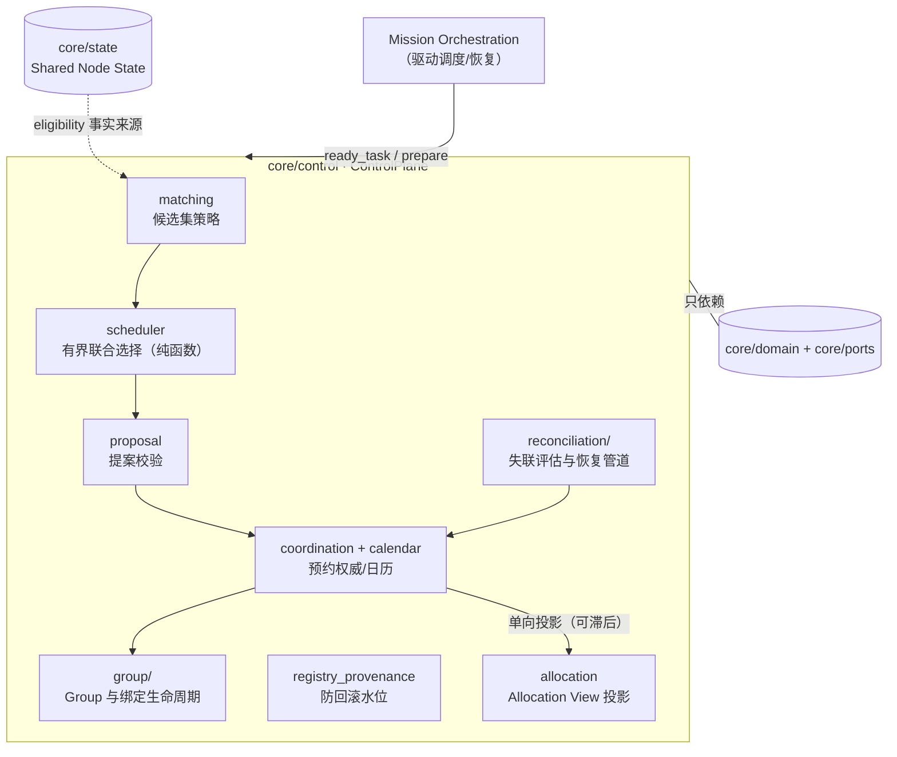
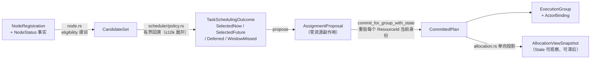
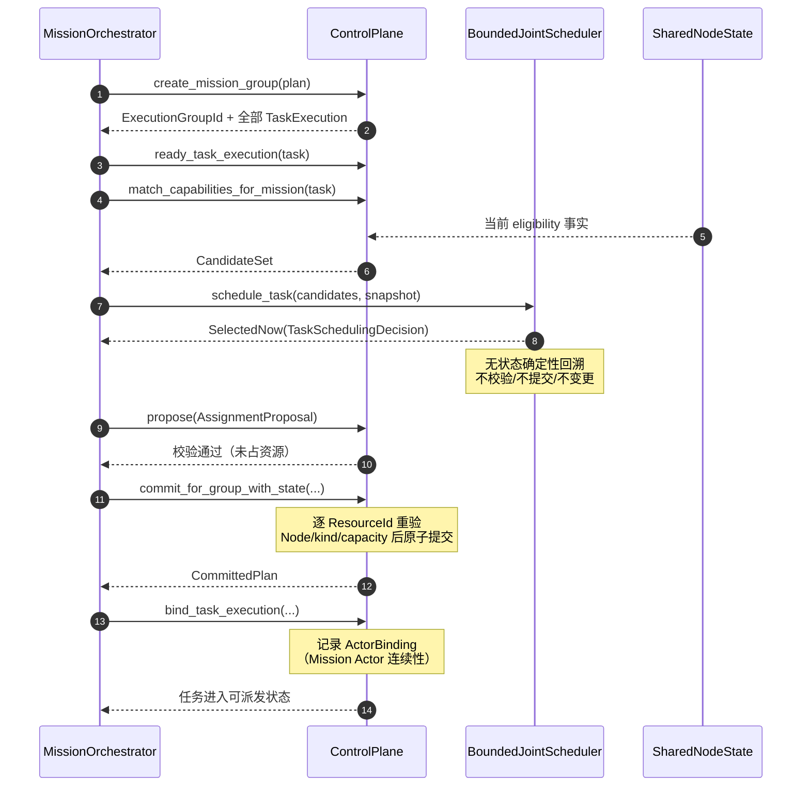
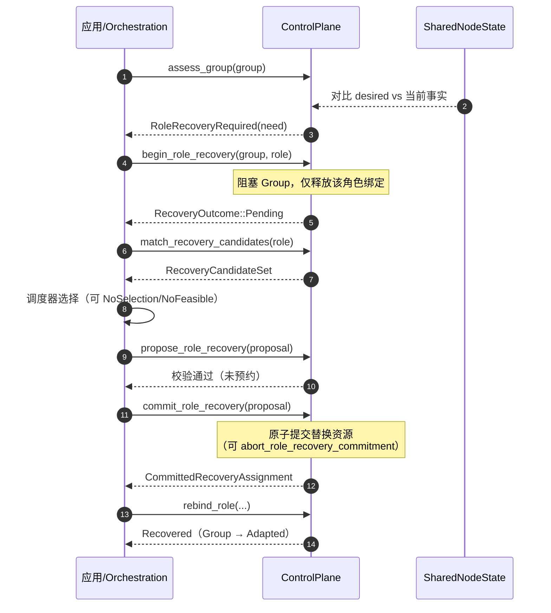

# 模块地图：Control Plane

对应 crate：[`core/control`](https://github.com/Farewell-CK/RoboGuide/tree/main/core/control)
（约 8,200 行产品代码 + 8,600 行测试；18 个产品模块、123 个测试函数）。
模块地图首页 · 上一篇：[Domain 与端口](domain-ports.md) · 下一篇：[Orchestration](orchestration.md)

**定位**（lib.rs）：Control Plane 门面与组合根。进程内权威 `ControlPlane` 持有：
节点租约权威、唯一资源预约权威、未来任务调度日历、Mission 级 Actor 绑定权威、
带防回滚 provenance 的部署实体注册表、Execution Group 与待定恢复承诺。

## 架构位置

Control 是唯一的资源承诺权威，被 Orchestration 驱动、被 State 观察，自身不做传输
也不解释执行意图：

## 权威边界

| Control 拥有 | Control 绝不做 |
| --- | --- |
| 资源 Commit/Revoke（唯一预约权威） | 不解释 ExecutionIntent 的 objective/参数 |
| Group 生命周期与 Rebind 决策 | 不做传输（属 integration） |
| 恢复承诺（pending commitment） | 不选择替换单元的"人选"（消费外部提案） |
| 调度日历与版本化快照 | 不持有 State 真相（Allocation 只是投影） |
| Actor/物理实体绑定持久化 | 不代替 Runtime 归约执行事实 |

## 数据流

一次调度的数据在 Control 内外的流转（注意每一步都是独立类型，边界可审计）：

## 正常路径时序

从 DAG 就绪到 Group 绑定的完整调用链（每个箭头是真实的公开 API）：

## 恢复路径时序（L2）

节点失联后的显式五步管道；未提交的恢复提案**不产生任何预约**：

## 模块地图

| 模块 | 职责 |
| --- | --- |
| `lib.rs` | `ControlPlane` 门面、`ControlCheckpoint`、`ControlError` 全部拒绝原因 |
| `coordination.rs` | 共享资源协调、预约权威、normal Commit |
| `matching.rs` | 能力候选集模型与匹配策略 |
| `proposal.rs` | 分配提案模型与校验边界 |
| `calendar.rs` | 未来预约日历与版本化调度快照 |
| `allocation.rs` | 权威预约 → 可观察 Allocation View 投影 |
| `node.rs` | 节点准入、心跳/租约、共享 eligibility 谓词 |
| `registry_provenance.rs` | 无路由表的持久防回滚证据水位 |
| `group/`（4 文件） | Group 生命周期、TaskExecution/Context 绑定、Mission 绑定、checkpoint 校验 |
| `reconciliation/`（3 文件） | 指派节点失联评估（只检测分歧，从不选节点）与恢复管道 |
| `scheduler/` | 有界联合调度策略（纯选择，不校验/不提交/不变更） |

## 关键类型

`ControlPlane` / `ControlCheckpoint` / `ControlError`（枚举每种拒绝：
`NoCandidate`、`ResourceConflict`、`PendingRecoveryCommitmentExists`…）；
`CandidateSet`、`AssignmentProposal`、`CommittedPlan`；
`ExecutionGroup` + `GroupLifecycle`（`Bound/Active/Adapted/Blocked/Failed/Completed/Released`）；
`ReconciliationAssessment`、`CommittedRecoveryAssignment`、`RecoveryOutcome`；
`BoundedJointScheduler`（无状态、`DEFAULT_SEARCH_EXPANSIONS = 10_000` 有界回溯）；
`TaskSchedulingOutcome`、`SchedulerError::NoFeasibleSelection/SearchLimited`；
`ScheduledTaskReservation` + `SchedulingReservationPhase`（`Scheduled/Activated/Invalidated`）。

## 未来预约与日历语义

- 就绪 Task 的未来区间由 Control 持久化为 `Scheduled`；到期后**重新执行完整
  Matching → Proposal → Commit → Bind** 才允许派发——`Activated` 只是 planning
  evidence，资源所有权仍属原预约权威。
- 运行超出估计结束时间时退化为开放占用：阻止冲突任务启动，但不抢占本地执行。
- 所有 normal/recovery Commit 都必须保护 future interval；Recovery 读取相同日历
  快照但不建立新的 future reservation。
- window-missed 证据按 Task 持久化去重并退出自动 timer dispatch，不终止应用定时器。

## 测试覆盖（15 个测试文件的主题）

正常 match→propose→commit 与候选拒绝规则；v0.8 Actor 绑定语义与注册表水位；
Actor 跨 Task 连续性；Allocation 投影相位；Commit 时资源身份重验
（[ADR-0042](../docs/decisions/0042-resource-identity-revalidation.md)）；
Group 生命周期保绑定；Mission 级 Group 创建/绑定流；节点注册/心跳/TTL 拒绝；
操作感知匹配（[ADR-0036](../docs/decisions/0036-operation-support-and-integrated-capability-baseline.md)）；
对账评估与恢复管道；恢复承诺生命周期（单待定/abort/mismatch）；注册表防回滚；
调度确定性选择、有界联合搜索预算、恢复调度共用日历。

## 实现状态

- 对账 slice v0.1 明确只处理**单个**不可用角色（`pipeline.rs` 显式拒绝多角色）。
- MissionPlan v0.8 绑定要求物理实体注册表已安装，否则拒绝。
- 租约字段标注"所有权评审待定"（`lib.rs`）。
- 旧单 Task Group 创建 API `create_group_with_actor_bindings` 已降为 `#[cfg(test)]`，
  新执行必须走 `create_mission_group`。

## 相关 ADR

[0004 恢复承诺生命周期](../docs/decisions/0004-recovery-commitment-lifecycle.md) ·
[0005 Allocation 投影权威](../docs/decisions/0005-allocation-state-projection-authority.md) ·
[0007 Actor 连续性](../docs/decisions/0007-mission-actor-continuity.md) ·
[0012 Controller checkpoint](../docs/decisions/0012-controller-checkpoint-recovery.md) ·
[0013 Mission 级 Execution Group](../docs/decisions/0013-mission-level-execution-group.md) ·
[0029 有界联合调度与未来预约](../docs/decisions/0029-bounded-joint-scheduling-and-future-reservations.md) ·
[0036 操作支持基线](../docs/decisions/0036-operation-support-and-integrated-capability-baseline.md) ·
[0040 Actor 与物理实体绑定](../docs/decisions/0040-mission-actor-binding-semantics.md) ·
[0041 类型化调度 disposition](../docs/decisions/0041-core-scheduling-disposition.md) ·
[0042 Commit 资源身份重验](../docs/decisions/0042-resource-identity-revalidation.md) ·
[0043 注册表防回滚](../docs/decisions/0043-registry-anti-rollback-provenance.md) ·
[0044 部署规划证据](../docs/decisions/0044-deployment-planning-evidence.md)

---

模块地图：[Domain 与端口](domain-ports.md) · [Control](control.md) ·
[Orchestration](orchestration.md) · [Runtime](runtime.md) ·
[State & Memory](state.md) · [Integration 与 Node](integration-node-service.md) ·
[Mission Intelligence](mission.md) · [Eval 与集成](evaluation.md)
