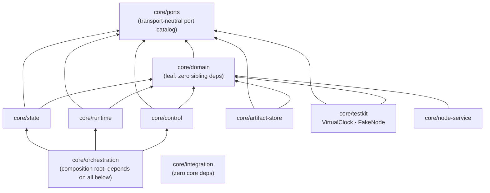
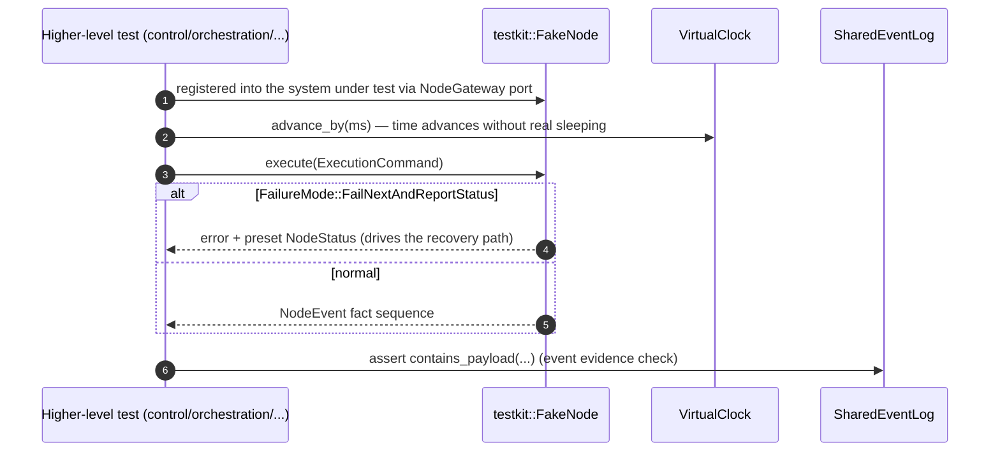

# Module map: Domain values & ports (foundations)

Crates: [`core/domain`](https://github.com/Farewell-CK/RoboGuide/tree/main/core/domain)
(~10,000 LOC), [`core/ports`](https://github.com/Farewell-CK/RoboGuide/tree/main/core/ports)
(~600 LOC), [`core/testkit`](https://github.com/Farewell-CK/RoboGuide/tree/main/core/testkit)
(~300 LOC). Module map home · Next: [Control Plane](control.md)

## core/domain — domain values shared across authorities

**Position** (lib.rs): the single definition point of all domain values shared
by Control, Runtime, and node adapters. Deliberately zero transport, zero
serialization SDK, zero simulator dependencies — it is the leaf of the core
dependency graph: every other crate depends on it, it depends on no sibling.

## Position in the architecture: root of the core dependency graph

### Module map

| Group | Modules | Responsibility (from each file's module doc) |
| --- | --- | --- |
| Foundation | `identity.rs` `time.rs` `error.rs` `event.rs` | strongly typed identities, task-relative time constraints, invariant errors, immutable event evidence |
| Mission/planning | `mission.rs` `mission_plan.rs` `task_requirement.rs` `task_execution.rs` `task_satisfaction.rs` `duration_estimate.rs` `context.rs` `actor.rs` | mission goal, Task Graph, Group-hosted task units, semantic satisfaction evidence, source-aware duration estimates, logical Actors |
| Execution | `execution/` (`command.rs` `intent.rs` `node_event.rs` `session.rs` `value.rs`) `execution_relation.rs` | transport-neutral execution intent/command/node events, shared-world execution session (ADR-0045), relation specs |
| Node fleet | `node_registration.rs` `node_state.rs` `node_health.rs` `lease.rs` `capability.rs` `physical_entity.rs` | registration & shared snapshots, reported health vs observed liveness, leases, capabilities, physical entities |
| Allocation/resources | `allocation.rs` `role_assignment.rs` `resource.rs` | observable allocation projection types (non-authoritative) |
| State/Memory | `memory.rs` `spatial_memory.rs` `spatial_replica.rs` `localization_evidence.rs` `state_model.rs` | immutable Memory manifests, map artifact values, replica evidence, strong localization evidence, source-aware State records |

### Key types

`MissionPlan` / `TaskGraph` / `PlannedTask`, `NodeStatus` / `NodeRegistration`,
`EventRecord` / `EventPayload`, `ExecutionCommand` / `ExecutionIntent`,
`AllocationViewSnapshot`, `ExecutionRelationSpec`, `MapArtifactManifest`,
`StateRecord` / `StateSource`, `TaskSatisfactionEvidence`, `NodeLease`.

### Design notes

- Every schema has an explicit version constant (`MISSION_PLAN_SCHEMA_V0_4`,
  `STATE_RECORD_SCHEMA_V0_1`, …) so compatibility paths are visible in one place.
- `state_model.rs` states its own constraint in its module doc: a record is "one
  attributed observation or declared view" and **never claims global truth**.
- Tests (`domain_tests.rs` + 3 more files) cover pure value semantics: Task
  Graph cycle rejection, plan identity mismatch, Memory invariants.

## core/ports — transport-neutral port catalog

**Position**: every port trait owned by the core, depending only on `domain`.
Implementations (`state`, `artifact-store`, gRPC layers, test doubles) implement
these ports; core logic programs only against them.

Complete port catalog (one line each):

| Port | Semantics |
| --- | --- |
| `Clock` | injectable monotonic clock (basis for virtual time in tests) |
| `EventSink` | append immutable event evidence |
| `SharedNodeStateReader/Writer` | Shared Node State contract (rejects stale observations) |
| `AllocationStateReader/Writer` | replace and read a non-authoritative Allocation View |
| `MemoryCatalogReader/Writer` | discoverable generic Memory catalog |
| `NodeGateway` | transport-neutral integration boundary for local EAIOS / vendor runtimes |
| `ArtifactBlobWriter/Reader/Store` | bounded-chunk immutable artifact bytes (deliberately no whole-blob byte access) |
| `MapCatalogReader/Writer` | map catalog evidence |
| `StateRecordReader/Writer` | independently attributed State records |
| `TaskSatisfactionEvidenceReader/Writer` | task satisfaction evidence |

## core/testkit — deterministic test infrastructure

**Position**: `VirtualClock` (virtual time, no real sleeping), `InMemoryEventLog`
/ `SharedEventLog`, and `FakeNode` implementing `NodeGateway` with injectable
`FailureMode::FailNext / FailNextAndReportStatus / SafeStopNext`. Depends only
on `domain + ports`, so every higher-level test is "ports + doubles", fully
offline.

### Test-double sequence (the pattern of all higher-level tests)

## Implementation status

- No TODO/FIXME/stub markers in any of the three crates; `deny(missing_docs)`
  and `forbid(unsafe_code)` fully in effect — function-level docs are complete.
- Compatibility constants are explicit (e.g. `LEGACY_MEMORY_CONSUMER_PROVIDER_ID`
  is used only to decode pre-v7 replica evidence) — legacy data paths are
  auditable, not implicit.

## Related ADRs

[0002 Node Contract](../docs/decisions/0002-deaios-node-contract.md) ·
[0003 MissionPlan contract](../docs/decisions/0003-mission-plan-contract.md) ·
[0011 Event evidence codec](../docs/decisions/0011-event-evidence-codec.md) ·
[0016 Distributed spatial memory](../docs/decisions/0016-distributed-spatial-memory.md) ·
[0017 Capability identity rules](../docs/decisions/0017-canonical-capability-contract-identity.md) ·
[0020 Execution coordination relations](../docs/decisions/0020-execution-coordination-relations.md) ·
[0024 Federated state & selective memory](../docs/decisions/0024-federated-state-and-selective-memory.md) ·
[0033 Task satisfaction boundary](../docs/decisions/0033-task-satisfaction-boundary.md)

---

Module maps: [Domain & ports](domain-ports.md) · [Control](control.md) ·
[Orchestration](orchestration.md) · [Runtime](runtime.md) ·
[State & Memory](state.md) · [Integration & Node](integration-node-service.md) ·
[Mission Intelligence](mission.md) · [Eval & integrations](evaluation.md)
