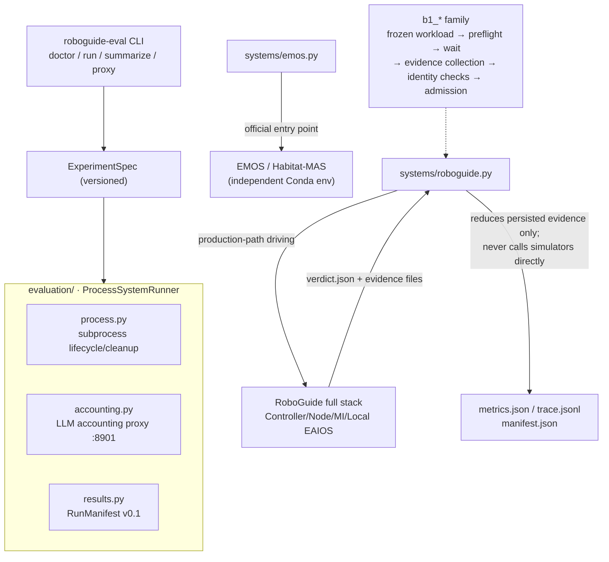
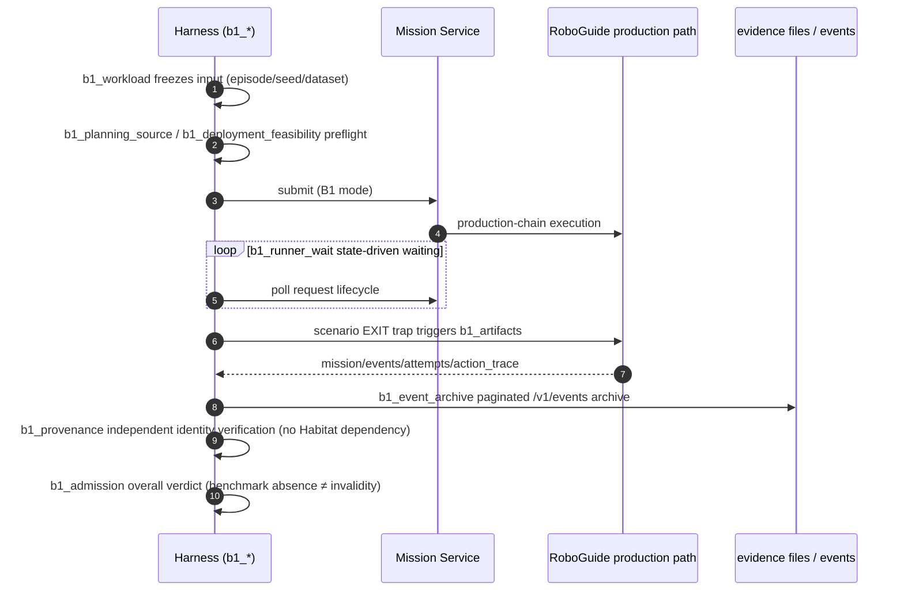
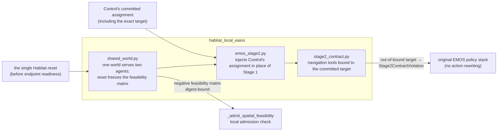

# Module map: Eval Harness & local integrations

Directories: [`evaluation/`](https://github.com/Farewell-CK/RoboGuide/tree/main/evaluation)
(Python, ~13,500 LOC source + ~8,900 LOC tests),
[`integrations/`](https://github.com/Farewell-CK/RoboGuide/tree/main/integrations),
and [`console/`](https://github.com/Farewell-CK/RoboGuide/tree/main/console).
Module map home · Previous: [Mission Intelligence](mission.md)

## evaluation/ — experiment-driven evaluation infrastructure

**Position**: experiment orchestration and reproducible-result infrastructure
independent of Core/Runtime/Control/State/Local-EAIOS. Hard boundaries: external
systems (Habitat-MAS/EMOS) are reached only across process boundaries and never
imported; the RoboGuide system runner accepts only persisted evidence produced
by the real Controller/Node/Runtime/Local-EAIOS production path and never
bypasses RoboGuide to call a simulator skill.

## Position in the architecture

## Formal B1 sequence

## Module map

| Group | Responsibility |
| --- | --- |
| Core | `models.py` (versioned ExperimentSpec), `config.py` (local.yaml machine overrides), `process.py` (subprocess lifecycle/cleanup), `runner.py` (`ProcessSystemRunner`), `results.py` (`RunManifest` v0.1: manifest/metrics/trace/stdout), `metrics.py` (canonical metric contract + unavailability mechanism) |
| Fairness | `e1_fairness.py` (dataset/task/benchmark-authority/embodiment/simulator/model-config identities + canonical digests), `benchmark_evidence.py` (tri-state benchmark-evidence authority and run-validity classification), `accounting.py` (local LLM accounting proxy) |
| Formal B1 | `b1_workload` → `b1_planning_source` / `b1_deployment_feasibility` → `b1_runner_wait` → `b1_artifacts` / `b1_event_archive` → `b1_provenance` → `b1_admission` / `b1_run` → `b1_live_view` |
| System adapters | `systems/emos.py` (official EMOS entry), `systems/roboguide.py` (`RoboGuideRunner`: reduces only persisted verdict evidence from the run directory) |
| MI probes | `mission_front/` (real-model chain cases/invariants/recording) |

**CLI** (`uv run roboguide-eval`): `doctor` · `run --system {emos,roboguide}` ·
`summarize` · `proxy` · `mission-front`. Machine-specific configuration stays in
the Git-ignored `evaluation/local.yaml` or `ROBOGUIDE_EVAL_*` environment
variables.

## integrations/ — deployment-side Local EAIOS adapters

**habitat-local-eaios** (~7,500 LOC, 147 tests): the C1-S0 reference bridge.
Key mechanisms:

- Local skill completion, benchmark PDDL success, episode termination, and the
  RoboGuide Mission outcome are four distinct facts that never stand in for
  each other.

**robonix-map-service** (single file, ~940 LOC, stdlib-only): the reference
adapter for "process health vs exact capability readiness" — `/v1/health` only
proves WebUI reachability; `/v1/readiness` runs the startup-fixed read-only ROS
service-discovery command and reports exact per-contract readiness (ADR-0019
semantics).

## console/ — read-only mission-journey visualizer

A zero-dependency static frontend (layered SVG stage + event-packet animation)
plus `serve.py` (stdlib static server with same-origin `/proxy/controller|mission`
reverse proxies). It only consumes existing HTTP APIs; the built-in demo events
mirror `core/domain::EventPayload` serde shapes but are **never** real evidence.

## Implementation status

- evaluation self-describes as a "first-version skeleton": process management/
  canonical metrics/manifest/CLI implemented; the official EMOS command mapping
  is carried by the local.yaml template; subgoal metric integration deferred.
- The B1 event archive confirms only `terminal_durable_prefix`, never a global
  snapshot.
- ADR-0045/0046/0047 are currently "Proposed for review" (not accepted).
- console and the robonix adapter are marked experimental.

## Related ADRs

[0006 Heterogeneous EAIOS integration contract](../docs/decisions/0006-heterogeneous-eaios-integration-contract.md) ·
[0016 Distributed spatial memory](../docs/decisions/0016-distributed-spatial-memory.md) ·
[0019 Capability readiness & localization evidence](../docs/decisions/0019-capability-readiness-and-localization-evidence.md) ·
[0021 Device extension conformance](../docs/decisions/0021-device-extension-boundary-conformance.md) ·
[0045 Shared-world execution session](../docs/decisions/0045-shared-world-execution-session.md) ·
[0046 Reset-state spatial admission](../docs/decisions/0046-reset-state-spatial-admission.md) ·
[0047 Reset-state deployment candidates](../docs/decisions/0047-reset-state-deployment-candidates.md)

---

Module maps: [Domain & ports](domain-ports.md) · [Control](control.md) ·
[Orchestration](orchestration.md) · [Runtime](runtime.md) ·
[State & Memory](state.md) · [Integration & Node](integration-node-service.md) ·
[Mission Intelligence](mission.md) · [Eval & integrations](evaluation.md)
