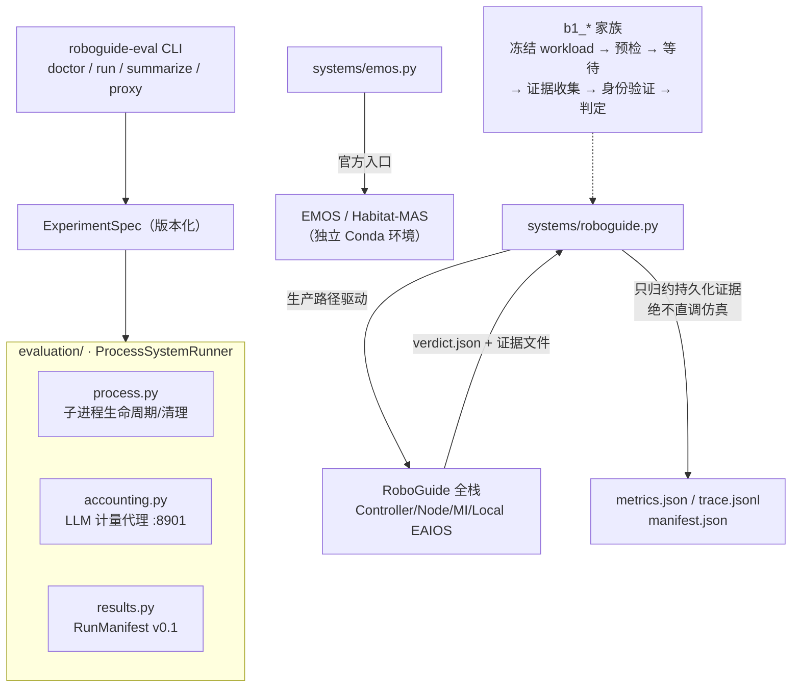
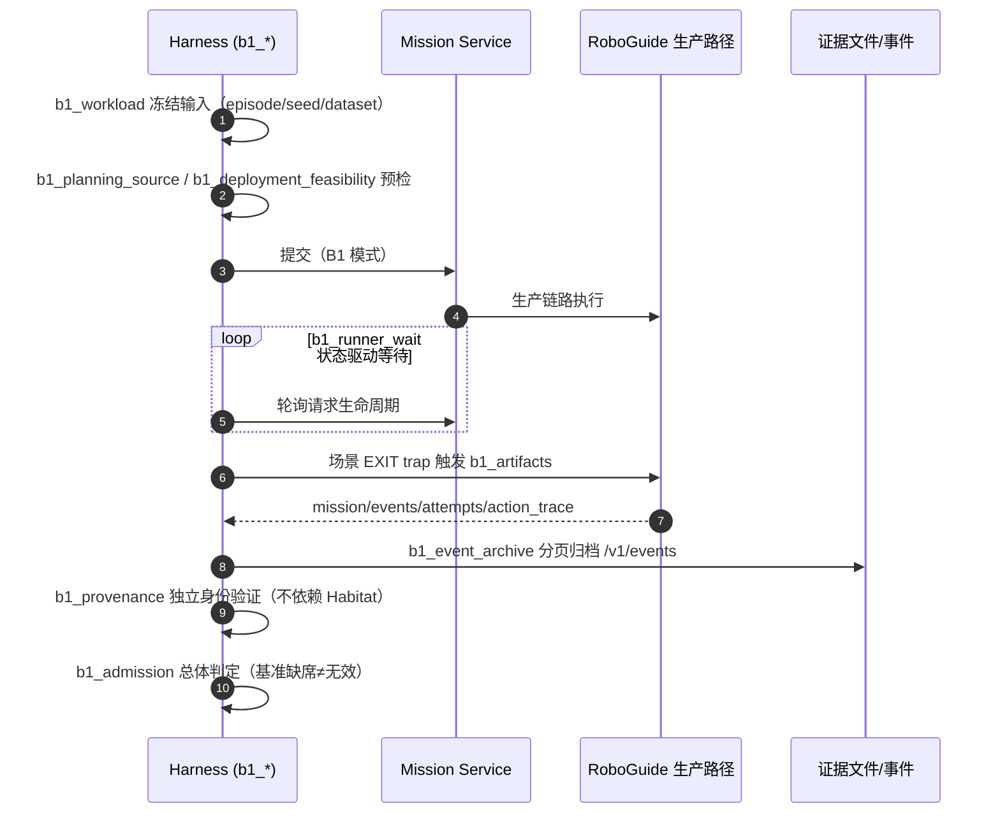
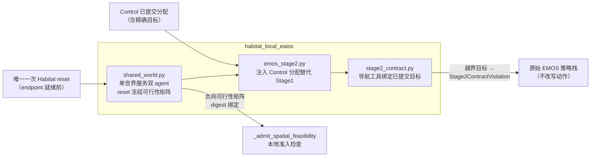

# 模块地图：Eval Harness 与本地集成

对应目录：[`evaluation/`](https://github.com/Farewell-CK/RoboGuide/tree/main/evaluation)
（Python，约 13,500 行源码 + 约 8,900 行测试）、
[`integrations/`](https://github.com/Farewell-CK/RoboGuide/tree/main/integrations)、
[`console/`](https://github.com/Farewell-CK/RoboGuide/tree/main/console)。
模块地图首页 · 上一篇：[Mission Intelligence](mission.md)

## evaluation/ —— 实验驱动评估基础设施

**定位**：独立于 Core/Runtime/Control/State/Local-EAIOS 的实验编排与可复现结果
基础设施。硬边界：外部系统（Habitat-MAS/EMOS）只通过子进程边界触达，绝不 import
其内部；RoboGuide 系统运行器只接受真实 Controller/Node/Runtime/Local-EAIOS 生产
路径产生的持久化证据，绝不绕过 RoboGuide 直调仿真技能。

## 架构位置

## Formal B1 时序

## 模块地图

| 模块组 | 职责 |
| --- | --- |
| 核心 | `models.py`（版本化 ExperimentSpec）、`config.py`（local.yaml 机器覆盖）、`process.py`（子进程生命周期/清理）、`runner.py`（`ProcessSystemRunner`）、`results.py`（`RunManifest` v0.1：manifest/metrics/trace/stdout）、`metrics.py`（规范度量契约 + 不可用机制） |
| 公平性 | `e1_fairness.py`（数据集/任务/基准权威/具身/仿真器/模型配置身份 + 规范摘要）、`benchmark_evidence.py`（基准证据三态权威与运行有效性分类）、`accounting.py`（本地 LLM 计量代理） |
| Formal B1 | `b1_workload` → `b1_planning_source` / `b1_deployment_feasibility` → `b1_runner_wait` → `b1_artifacts` / `b1_event_archive` → `b1_provenance` → `b1_admission` / `b1_run` → `b1_live_view` |
| 系统适配 | `systems/emos.py`（官方 EMOS 入口）、`systems/roboguide.py`（`RoboGuideRunner`：只归约运行目录中的持久化 verdict 证据） |
| MI 探针 | `mission_front/`（真实模型链路的用例/不变量/记录） |

**CLI**（`uv run roboguide-eval`）：`doctor` · `run --system {emos,roboguide}` ·
`summarize` · `proxy` · `mission-front`。机器相关配置全部在 Git 忽略的
`evaluation/local.yaml` 或 `ROBOGUIDE_EVAL_*` 环境变量。

## integrations/ —— 部署侧 Local EAIOS 适配器

**habitat-local-eaios**（约 7,500 行，147 个测试）：C1-S0 参考桥。关键机制：

- 本地技能完成、基准 PDDL 成功、episode 终止、RoboGuide Mission 结果是四个
  独立事实，互不冒充。

**robonix-map-service**（单文件约 940 行，stdlib-only）：示范"进程健康与能力
readiness 分离"的地图适配器——`/v1/health` 只证明 WebUI 可达；`/v1/readiness`
用启动固定的只读 ROS service 发现命令逐 contract 报告精确就绪（ADR-0019 语义）。

## console/ —— 只读任务旅程可视化

零依赖静态前端（分层 SVG 舞台 + 事件包流动画）+ `serve.py`（stdlib 静态服务
带同源 `/proxy/controller|mission` 反代）。只消费既有 HTTP API；内置演示事件
镜像 `core/domain::EventPayload` serde 形状但**不是**真实证据。

## 实现状态

- evaluation 自述"第一版骨架"：进程管理/规范度量/manifest/CLI 已实；EMOS 官方
  命令映射由 local.yaml 模板承载；子目标度量集成延后。
- B1 事件归档只确认 `terminal_durable_prefix`，不宣称全局快照。
- ADR-0045/0046/0047 当前状态为 "Proposed for review"（尚未接受）。
- console 与 robonix 适配器标注 experimental。

## 相关 ADR

[0006 异构 EAIOS 集成契约](../docs/decisions/0006-heterogeneous-eaios-integration-contract.md) ·
[0016 分布式空间记忆](../docs/decisions/0016-distributed-spatial-memory.md) ·
[0019 能力就绪与定位证据](../docs/decisions/0019-capability-readiness-and-localization-evidence.md) ·
[0021 设备扩展一致性](../docs/decisions/0021-device-extension-boundary-conformance.md) ·
[0045 共享世界执行会话](../docs/decisions/0045-shared-world-execution-session.md) ·
[0046 Reset 态空间准入](../docs/decisions/0046-reset-state-spatial-admission.md) ·
[0047 Reset 态部署候选](../docs/decisions/0047-reset-state-deployment-candidates.md)

---

模块地图：[Domain 与端口](domain-ports.md) · [Control](control.md) ·
[Orchestration](orchestration.md) · [Runtime](runtime.md) ·
[State & Memory](state.md) · [Integration 与 Node](integration-node-service.md) ·
[Mission Intelligence](mission.md) · [Eval 与集成](evaluation.md)
