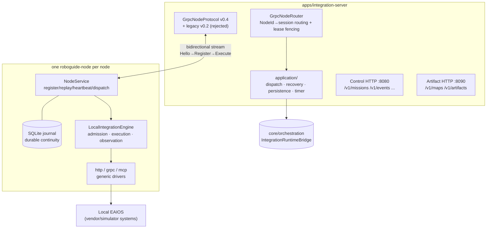
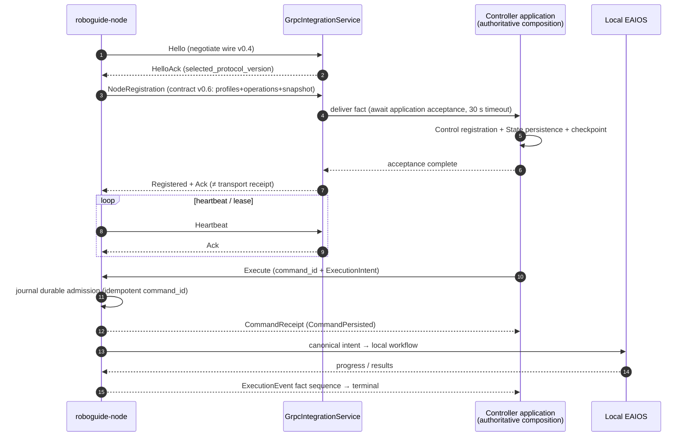

# Module map: Integration & Node Service

Crates: [`core/integration`](https://github.com/Farewell-CK/RoboGuide/tree/main/core/integration)
(~1,550 LOC production + ~710 LOC tests) and
[`core/node-service`](https://github.com/Farewell-CK/RoboGuide/tree/main/core/node-service)
(~14,700 LOC production + ~5,600 LOC tests, 104 test functions), plus all
Rust/Python composition roots under `apps/`. Module map home ·
Previous: [State & Memory](state.md) · Next: [Mission Intelligence](mission.md)

## core/integration — Node Protocol v0.4 transport

**Position**: the wire/session/router of the formal gRPC Node Protocol.
Bidirectional streaming, concurrent node sessions, lease fencing (15 s lease,
250 ms checks), NodeId command routing. **Zero** dependencies on Control/
State/Runtime/Local-EAIOS code — bridging that needs those authorities lives
in `core/orchestration`.

Version constants (`grpc.rs`): wire `roboguide.node-protocol/v0.4` carrying
semantic contract `roboguide.node.v0.6` (v0.5/v0.4 explicitly compatible; the
v0.2 endpoint is retired and returns a migration error).

Key semantics: `Registered` and sequence `Ack`s are not transport receipts —
`GrpcNodeEventDelivery` waits for the Controller composition to accept and
persist the fact through the existing authorities (30 s application-acceptance
timeout) before replying to the node (ADR-0023).

## Transport and node architecture

## Node Protocol lifecycle sequence

## core/node-service — the generic node service

**Position**: a configuration-driven generic node-side service: lifecycle
(`NodeService::run` — "recovers durable executions and reconnects forever
after session loss"), TOML config compilation (schema v0.2–v0.7), a SQLite
execution journal, and the declarative Local Integration Engine.

| Subsystem | Responsibility |
| --- | --- |
| `service/` | v0.4 lifecycle: register/snapshot replay/heartbeat/dispatch; `Execute` is idempotent on `command_id == "dispatch-{execution_id}"` |
| `engine/` | declarative workflow execution: admission (durable authority), execution (local execution/artifact finalization/fact reduction/resource locks), observation, validation, memory operations |
| `journal/` | durable execution identity and lifecycle journal (SQLite schema/migration/recovery) |
| `local_engine/` | startup-compiled local catalog + three generic drivers: `http_driver` / `grpc_driver` (descriptor-driven) / `mcp_driver` |
| `artifact/` | node-side spatial-memory artifacts: HTTP client, filesystem validation, staging/verification/publication |
| `memory.rs` | `FilesystemMemoryLedger`: immutable-manifest ledger + JSONL index rebuild (not EAIOS storage) |
| `conformance.rs` | offline extension-conformance compilation and reporting (v0.1/v0.2) |

**Adding a Local EAIOS never touches core code**: config declares Local
Systems, capability profiles, canonical operation workflows, fixed endpoints,
and constrained field mappings; vendor SDKs/ROS topics (Local How) are never
promoted to global protocols. One unit test asserts that production sources
contain no Local-EAIOS product names.

## Composition roots (apps/)

| App | Role | Highlights |
| --- | --- | --- |
| `apps/controller` | executable evidence of the first control slice | no network: 3-node registration → scheduling → commit → FakeNode execution → recovery → Group release |
| `apps/integration-server` | formal gRPC server composition root | positional args: gRPC `:50051`, event DB, Control HTTP `:8080`, Artifact HTTP `:8090`; HTTP limits 64 KiB headers / 1 MiB body / 30 s timeout; checkpoint wrapper schema v17 |
| `apps/roboguide-node` | node daemon composition root | `--validate`/`conformance` offline config checks; wires the three drivers + Engine + Service by default |
| `apps/mission-service` | Python Mission Request composition root | `--mission-config`/`--service-config`; default `127.0.0.1:8070` |
| `apps/real-node-smoke` | v0.4 protocol probe | `--endpoint` handshake/registration/heartbeat; `--simulate-execute` full-loop synthetic Mission |

Control HTTP routes: `GET /healthz /v1/inventory /v1/state/* /v1/memory/providers
/v1/events /v1/execution-attempts /v1/scheduling-reservations`; `POST
/v1/missions` (plus `/{id}`, `/{id}/cancel`, `/v1/executions/{id}`, …).
Artifact HTTP: `/v1/artifacts/{id}` streaming, `/v1/maps`, `/v1/memories`,
chunked uploads at `/v1/artifact-uploads/{id}/content|/finalize`.

## Implementation status

- Wire v0.4 / contract v0.6 / config v0.7 are all **additive evolutions**;
  legacy inputs are explicitly compatible, never silently dropped.
- The execution-session metadata `roboguide.execution-session/v0.1` is the only
  session schema currently understood (ADR-0045 context).
- The legacy synchronous HTTP NodeGateway is retired (ADR-0022); extension
  onboarding goes through config + offline conformance checks (ADR-0021).

## Related ADRs

[0009 gRPC Node Protocol](../docs/decisions/0009-node-service-grpc-protocol.md) ·
[0010 Single Node Service & declarative engine](../docs/decisions/0010-single-node-service-local-integration-engine.md) ·
[0011 Event evidence codec](../docs/decisions/0011-event-evidence-codec.md) ·
[0021 Device extension conformance](../docs/decisions/0021-device-extension-boundary-conformance.md) ·
[0022 Retire legacy adapters](../docs/decisions/0022-retire-legacy-adapters-and-isolate-artifact-store.md) ·
[0023 Application-accepted protocol facts](../docs/decisions/0023-application-accepted-node-protocol-facts.md) ·
[0028 Durable command & attempts](../docs/decisions/0028-durable-command-recovery-and-attempts.md)

---

Module maps: [Domain & ports](domain-ports.md) · [Control](control.md) ·
[Orchestration](orchestration.md) · [Runtime](runtime.md) ·
[State & Memory](state.md) · [Integration & Node](integration-node-service.md) ·
[Mission Intelligence](mission.md) · [Eval & integrations](evaluation.md)
