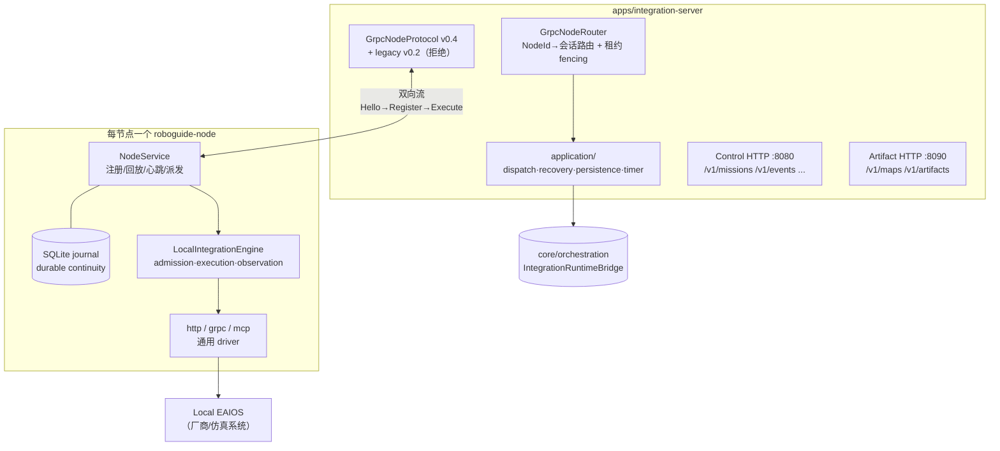
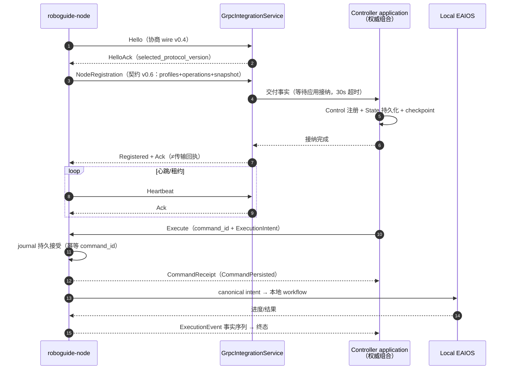

# 模块地图：Integration 与 Node Service

对应 crate：[`core/integration`](https://github.com/Farewell-CK/RoboGuide/tree/main/core/integration)
（约 1,550 行产品代码 + 710 行测试）、
[`core/node-service`](https://github.com/Farewell-CK/RoboGuide/tree/main/core/node-service)
（约 14,700 行产品代码 + 5,600 行测试，104 个测试函数），以及全部 Rust/Python
组合根 `apps/`。
模块地图首页 · 上一篇：[State & Memory](state.md) · 下一篇：[Mission Intelligence](mission.md)

## core/integration —— Node Protocol v0.4 传输层

**定位**：正式 gRPC Node Protocol 的 wire/session/router。双向流、并发节点会话、
租约 fencing（15s 租约、250ms 检查）、NodeId 命令路由。**零依赖** Control/State/
Runtime/Local-EAIOS 代码——需要这些权威的桥接在 `core/orchestration`。

版本常量（`grpc.rs`）：wire `roboguide.node-protocol/v0.4` 携带语义契约
`roboguide.node.v0.6`（v0.5/v0.4 显式兼容；v0.2 endpoint 已退役返回迁移错误）。

关键语义：`Registered` 与序列 `Ack` 不是传输回执——`GrpcNodeEventDelivery`
等待 Controller composition 用既有权威接受并持久化事实（30s 应用接纳超时）
后才回复节点（ADR-0023）。

## 传输与节点架构

## Node Protocol 生命周期时序

## core/node-service —— 通用节点服务

**定位**：配置驱动的通用节点侧服务：生命周期（`NodeService::run`
"恢复持久执行并在会话丢失后永远重连"）、TOML 配置编译（schema v0.2–v0.7）、
SQLite 执行日志、声明式 Local Integration Engine。

| 子系统 | 职责 |
| --- | --- |
| `service/` | v0.4 生命周期：注册/快照回放/心跳/派发；`Execute` 以 `command_id == "dispatch-{execution_id}"` 幂等 |
| `engine/` | 声明式工作流执行：admission（持久权威准入）、execution（本地执行/产物终结/事实归约/资源锁）、observation、validation、memory 操作 |
| `journal/` | 持久执行身份与生命周期日志（SQLite schema/迁移/恢复） |
| `local_engine/` | 启动编译的本地目录 + 三种通用 driver：`http_driver` / `grpc_driver`（descriptor 驱动）/ `mcp_driver` |
| `artifact/` | 节点侧空间记忆产物：HTTP 客户端、文件系统校验、staging/验证/发布 |
| `memory.rs` | `FilesystemMemoryLedger`：不可变 manifest 账本 + JSONL 重建索引（非 EAIOS 存储） |
| `conformance.rs` | 离线扩展一致性编译与报告（v0.1/v0.2） |

**新增 Local EAIOS 不改任何核心代码**：配置声明 Local System、capability profile、
canonical operation workflow、固定 endpoint 与受限字段映射；厂商 SDK/ROS topic
等 Local How 不提升为全局协议。有一个单元测试专门断言产品源码不含任何
Local-EAIOS 产品名词。

## 组合根（apps/）

| 应用 | 角色 | 要点 |
| --- | --- | --- |
| `apps/controller` | 首个控制切片的可执行证据 | 无网络：3 节点注册→调度→提交→FakeNode 执行→恢复→Group 释放 |
| `apps/integration-server` | 正式 gRPC 服务组合根 | 位置参数：gRPC `:50051`、事件 DB、Control HTTP `:8080`、Artifact HTTP `:8090`；HTTP 面 64KiB 头/1MiB 体/30s 超时；checkpoint 包装 schema v17 |
| `apps/roboguide-node` | 节点守护进程组合根 | `--validate`/`conformance` 离线校验配置；默认装配三 driver + Engine + Service |
| `apps/mission-service` | Python Mission Request 组合根 | `--mission-config`/`--service-config`；默认 `127.0.0.1:8070` |
| `apps/real-node-smoke` | v0.4 协议探针 | `--endpoint` 握手/注册/心跳；`--simulate-execute` 全回路合成 Mission |

Control HTTP 主要路由：`GET /healthz /v1/inventory /v1/state/* /v1/memory/providers
/v1/events /v1/execution-attempts /v1/scheduling-reservations`；
`POST /v1/missions`（+ `/{id}`、`/{id}/cancel`、`/v1/executions/{id}`…）。
Artifact HTTP：`/v1/artifacts/{id}` 流式下载、`/v1/maps`、`/v1/memories`、
分块上传 `/v1/artifact-uploads/{id}/content|/finalize`。

## 实现状态

- wire v0.4 / 契约 v0.6 / 配置 v0.7 均为**加性演进**，旧输入显式兼容不静默丢弃。
- 执行会话 metadata `roboguide.execution-session/v0.1` 是当前唯一被理解的
  会话 schema（ADR-0045 上下文）。
- 旧同步 HTTP NodeGateway 已退役（ADR-0022）；扩展接入走配置 + 离线一致性
  检查（ADR-0021）。

## 相关 ADR

[0009 gRPC Node Protocol](../docs/decisions/0009-node-service-grpc-protocol.md) ·
[0010 单一 Node Service 与声明式引擎](../docs/decisions/0010-single-node-service-local-integration-engine.md) ·
[0011 事件证据编解码](../docs/decisions/0011-event-evidence-codec.md) ·
[0021 设备扩展边界一致性](../docs/decisions/0021-device-extension-boundary-conformance.md) ·
[0022 退役旧适配器](../docs/decisions/0022-retire-legacy-adapters-and-isolate-artifact-store.md) ·
[0023 应用接纳的协议事实](../docs/decisions/0023-application-accepted-node-protocol-facts.md) ·
[0028 持久命令与尝试](../docs/decisions/0028-durable-command-recovery-and-attempts.md)

---

模块地图：[Domain 与端口](domain-ports.md) · [Control](control.md) ·
[Orchestration](orchestration.md) · [Runtime](runtime.md) ·
[State & Memory](state.md) · [Integration 与 Node](integration-node-service.md) ·
[Mission Intelligence](mission.md) · [Eval 与集成](evaluation.md)
