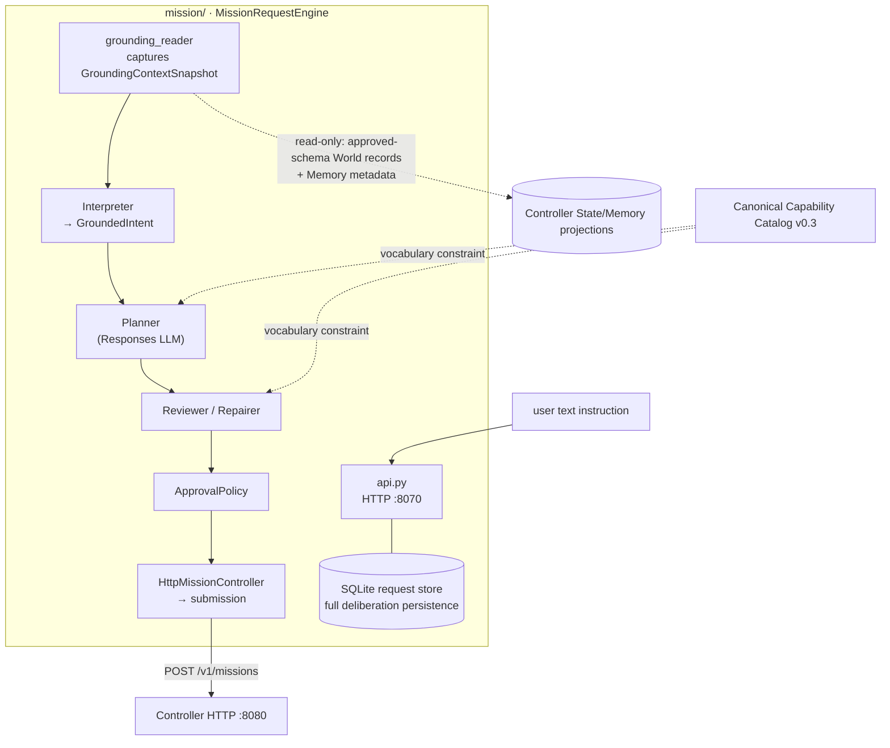
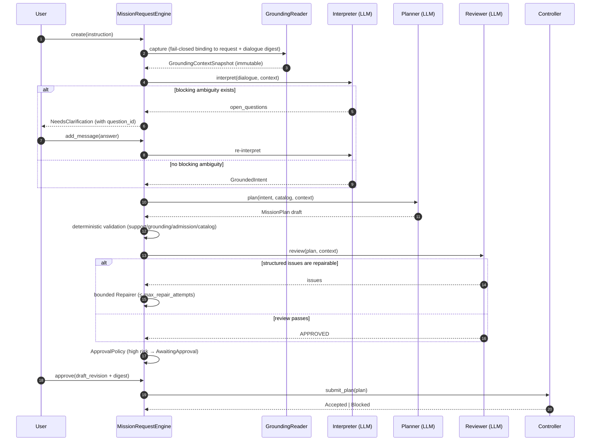

# Module map: Mission Intelligence

Package: [`mission/`](https://github.com/Farewell-CK/RoboGuide/tree/main/mission)
(Python, `src/mission/` — 32 modules, ~10,400 LOC + ~8,100 LOC tests) and the
composition root
[`apps/mission-service`](https://github.com/Farewell-CK/RoboGuide/tree/main/apps/mission-service).
Module map home · Previous: [Integration & Node](integration-node-service.md) ·
Next: [Eval & integrations](evaluation.md)

**Position**: the deliberation loop that turns a user's text instruction into
a versioned MissionPlan Task Graph — interpretation, blocking clarification,
planning, structured review, bounded repair, risk approval, and submission. It
creates Mission/Task/Context/Role identities but **does not own** node
assignment, resource commitment, execution groups, or local device control,
and it never mirrors execution lifecycle.

## Position in the architecture

## Request pipeline sequence

Lifecycle state machine: `Received → Interpreting → (NeedsClarification ⇄) →
Drafted → Reviewing → (Repairing ⇄) → AwaitingApproval → Submitting → Accepted
| Blocked | Failed | Cancelled`. On startup `_recover_interrupted()` fences
interrupted states to `Failed` instead of blindly resuming.

## Module groups

| Stage | Modules |
| --- | --- |
| Ingress / grounding | `api.py` (HTTP composition root), `grounding_context.py`, `grounding_reader.py`, `semantic_evidence.py`, `planning_world_evidence.py`, `planning_profile.py`, `execution_profile.py` |
| Interpret | `request_record.py` (durable request projection + Interpreter protocol), `intent.py` |
| Plan | `planners.py`, `responses.py` (Responses-API LLM adapters ×4 roles), `provider_mission_plan.py`, `capability_catalog.py` |
| Review / repair | `review.py` (structured review + routing), `rejected_draft.py` (rejected-draft evidence) |
| Admission / approval / submit | `semantic_admission.py`, `approval.py`, `satisfaction_policy.py`, `controller.py`, `submission_evidence.py` |
| Orchestration / persistence / config | `request_engine.py`, `request_store.py` (SQLite), `config.py`, `service_config.py`, contract-value modules (`models.py` `task.py` `role.py` `context.py`, …) |

## Prompts (`mission/prompts/v0/`)

`interpreter.md` (one self-contained objective + confirmed constraints + only
blocking questions), `planner.md` (acyclic Task Graph using only catalog
vocabulary), `reviewer.md` (independent review; the planning profile is only a
startup-frozen abstract summary), `repairer.md` (fix only structured issues,
preserving mission identity/objective/the same grounding).

## Key design facts

- The Interpreter **never reads** live Node/Resource inventory — a missing
  provider is a Control scheduling condition, not a semantic rejection
  (ADR-0030).
- The Grounding Snapshot contains only deployment-approved-schema World records
  and global Memory **metadata**; metadata never implies payload was read. All
  four model roles share the same digest-bound snapshot (ADR-0037).
- Planning-world evidence (static world facts bound to episode/scene/dataset)
  keeps unknown gaps until confirmed by reset; the model never guesses floors,
  start positions, or reachability (ADR-0044).
- The satisfaction freshness policy is explicitly versioned; Planner/Reviewer/
  Repairer consume the same policy digest and never invent numbers to fill the
  schema (ADR-0039).

## HTTP surface (`apps/mission-service`, default `127.0.0.1:8070`)

`GET /healthz`; `POST /v1/mission-requests` (`{"instruction": ...}`); `GET
.../{id}`, `.../{id}/observations`, `.../{id}/grounding-contexts/{digest}`;
`POST .../{id}/messages`, `.../approve` (`draft_revision`+`draft_digest`),
`.../retry`, `.../cancel`. Configuration: `config/mission.toml` (models, prompt
versions, repair budgets) and `config/mission-service.toml` (listener, grounding
limits, approval-rule array).

## Tests (23 files, fully offline)

Engine lifecycle, rejected-draft recovery, planners, review routing,
coordination guidance, grounding context, contract validation, capability
catalog, config, approval policy, submission observability, and more.

## Implementation status

- MissionPlan contract: v0.3–v0.5 compatible input, **v0.8 current**; Mission
  Request projection v0.4 current (v0.1–v0.3 readable).
- Grounding Context v0.3 is selected only when a planning-world evidence file
  exists.
- Regeneration triggers only on `RejectedPlanError` (transport/auth failures
  never burn the budget).

## Related ADRs

[0018 Intent grounding loop](../docs/decisions/0018-mission-intent-loop.md) ·
[0030 Semantic admission & deployability](../docs/decisions/0030-mission-semantic-admission-and-deployability.md) ·
[0031 Canonical capability catalog](../docs/decisions/0031-canonical-capability-catalog.md) ·
[0032 Review & repair loop](../docs/decisions/0032-mission-review-and-repair-loop.md) ·
[0034 Semantic contract normalization](../docs/decisions/0034-mission-semantic-contract-normalization.md) ·
[0037 Grounding context](../docs/decisions/0037-mission-grounding-context.md) ·
[0038 Blocking clarification & grounding acquisition](../docs/decisions/0038-blocking-clarification-and-grounding-acquisition.md) ·
[0039 Satisfaction freshness policy](../docs/decisions/0039-mission-satisfaction-freshness-policy.md) ·
[0044 Deployment planning evidence](../docs/decisions/0044-deployment-planning-evidence.md)

---

Module maps: [Domain & ports](domain-ports.md) · [Control](control.md) ·
[Orchestration](orchestration.md) · [Runtime](runtime.md) ·
[State & Memory](state.md) · [Integration & Node](integration-node-service.md) ·
[Mission Intelligence](mission.md) · [Eval & integrations](evaluation.md)
