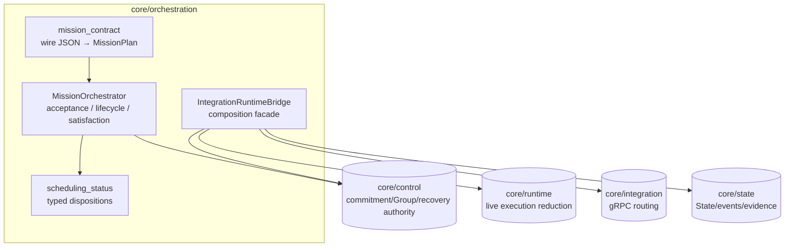
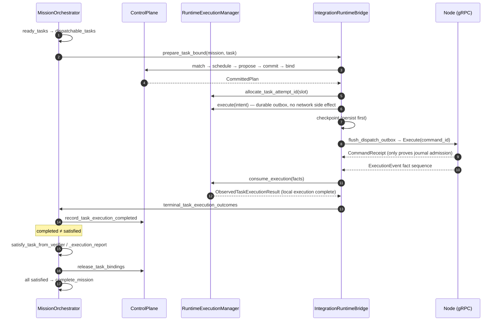

# Module map: Mission Orchestration

Crate: [`core/orchestration`](https://github.com/Farewell-CK/RoboGuide/tree/main/core/orchestration)
(~6,300 LOC production + ~5,000 LOC tests). Module map home ·
Previous: [Control](control.md) · Next: [Runtime](runtime.md)

**Position** (lib.rs): the Mission execution authority over the complete
MissionPlan and its long-lived Group. It accepts the immutable plan, drives
ready-Task scheduling through Control, consumes Runtime evidence for task
satisfaction and Mission completion, and hosts `IntegrationRuntimeBridge` — the
composition facade translating formal Node Protocol facts into
Runtime/Control/State semantics. It is the only crate depending on
`control + runtime + integration + state` at once.

## Position in the architecture

Orchestration composes all core crates while every authority stays in its
owning crate:

## Data flow

The main data flow from wire JSON to Mission terminal state:

```mermaid
flowchart LR
    A["wire JSON<br/>mission-plan/v0.2-v0.8"] -->|"decode_mission_plan<br/>validation"| B["MissionPlan (immutable)"]
    B -->|"submit + create_mission_group"| C["MissionExecution<br/>+ ExecutionGroup"]
    C -->|"ready_tasks / prepare_task"| D["SchedulingDisposition<br/>Deferred / ReconciliationRequired<br/>/ InvalidContract / InternalFailure"]
    D -->|"prepare_task_bound<br/>+ allocate_task_attempt_id"| E["DispatchIntent (durable)"]
    E -->|"flush_dispatch_outbox<br/>checkpoint before routing"| F["gRPC Execute"]
    F --> G["ExecutionEvent fact stream"]
    G -->|"consume_execution reduction"| H["RemoteExecutionStatus<br/>→ ObservedTaskExecutionResult"]
    H -->|"satisfy_task_from_*"| I["TaskSatisfied → DAG advances<br/>→ Mission Completed"]
```

## End-to-end sequence

One submitted Task from preparation through dispatch to fact ingestion and
satisfaction:

## Module map

| Module | Responsibility |
| --- | --- |
| `lib.rs` | `MissionOrchestrator`, `MissionExecution`, `MissionExecutionLifecycle` |
| `mission/checkpoint.rs` | Mission checkpoint, submission, Control-authority cross-check |
| `mission/lifecycle.rs` | runtime outcome, cancellation, readiness, Mission completion transitions |
| `mission/scheduling.rs` | ready-Task scheduling and committed-task preparation |
| `mission/serialization.rs` | stable MissionPlan checkpoint serialization (v0.6-compatible / v0.8 normalized) |
| `mission/timing.rs` | Mission-relative timing anchor validation and scheduling release |
| `mission_contract/` (5 files) | MissionPlan v0.2–v0.8 JSON wire boundary: wire docs, decode validation, enum/timing conversion |
| `integration_bridge/` (7 files) | protocol event ingestion, execution-fact reduction, dispatch/cancel, lease liveness, relation views, checkpoint |
| `mechanism_profile.rs` | closed preflight of execution-coordination mechanisms supported by this build |
| `scheduling_status.rs` | typed scheduling disposition at the application boundary |

## Key types

`MissionOrchestrator`, `MissionExecution`, `MissionExecutionLifecycle`
(`Accepted → Running → Cancelling → Completed/Failed/Cancelled`);
`IntegrationRuntimeBridge<E>` (wraps `ControlPlane + SharedNodeState + EventSink
+ GrpcNodeRouter`); `SchedulingDeferral` (12 durable reasons) and
`SchedulingDisposition`; `SupportedMechanismProfile` (currently only
`RequiresActive` and `SharedSpatialReference` pass); `GroupSharedViewSnapshot` /
`GroupViewFreshness` (selective group shared views).

## Cancellation and recovery semantics

- `cancel → request_cancel → finalize_cancel`: while Cancelling, Group ownership
  is retained until every attempt has terminal evidence.
- Restored executions are fenced by `ExecutionRuntimeError::ReconciliationRequired`;
  the bridge checkpoint schema is `roboguide.controller-checkpoint/v15`
  (application wrapper v17).
- `SupportedMechanismProfile` rejects structurally valid relation types with no
  Runtime reducer (e.g. `RelativePose`) before Group creation instead of leaving
  them indefinitely Unknown.

## Test coverage (themes of 9 test files)

Plan contract and fixture acceptance; Mission execution/Context reuse/
cancellation lifecycle; scheduling and future reservations; bridge checkpoint
ingestion, dispatch recovery and cancellation, wire conversion and fact
fencing, recovery fences retaining physical evidence, relation views,
State/localization evidence views.

## Implementation status

- The whole crate is scoped as "Phase 1" authority (deterministic DAG
  orchestration, single default Group).
- `mission_contract/mod.rs` documents a "v0.2–v0.7 boundary" while `decode.rs`
  already references v0.8 constants — minor doc drift; code follows v0.8.

## Related ADRs

[0012 Controller checkpoint recovery](../docs/decisions/0012-controller-checkpoint-recovery.md) ·
[0013 Mission-level Execution Group](../docs/decisions/0013-mission-level-execution-group.md) ·
[0014 Phase 1 orchestration boundary](../docs/decisions/0014-phase1-mission-orchestration.md) ·
[0027 Coordination evidence completion](../docs/decisions/0027-runtime-coordination-evidence-completion.md) ·
[0028 Durable command & attempts](../docs/decisions/0028-durable-command-recovery-and-attempts.md) ·
[0033 Task satisfaction boundary](../docs/decisions/0033-task-satisfaction-boundary.md) ·
[0041 Typed scheduling disposition](../docs/decisions/0041-core-scheduling-disposition.md) ·
[0045 Shared-world execution session](../docs/decisions/0045-shared-world-execution-session.md)

---

Module maps: [Domain & ports](domain-ports.md) · [Control](control.md) ·
[Orchestration](orchestration.md) · [Runtime](runtime.md) ·
[State & Memory](state.md) · [Integration & Node](integration-node-service.md) ·
[Mission Intelligence](mission.md) · [Eval & integrations](evaluation.md)
