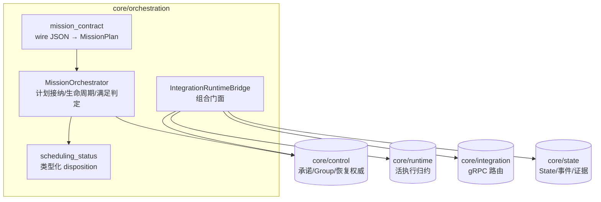
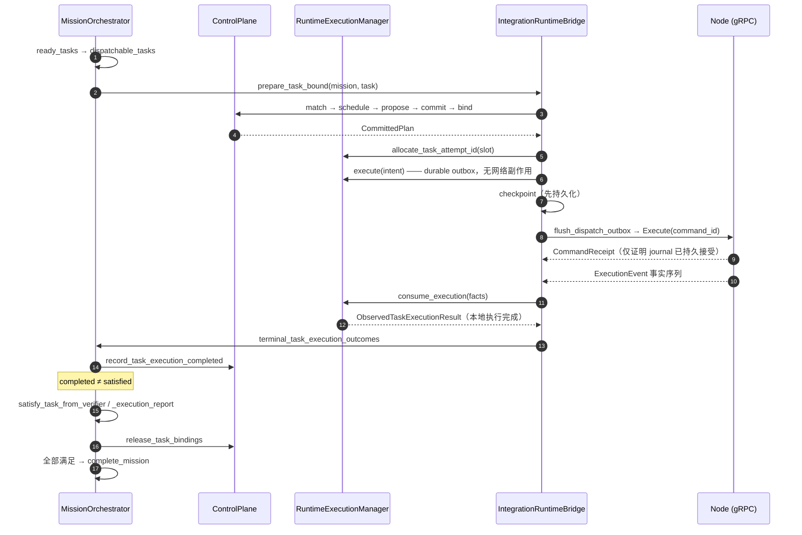

# 模块地图：Mission Orchestration

对应 crate：[`core/orchestration`](https://github.com/Farewell-CK/RoboGuide/tree/main/core/orchestration)
（约 6,300 行产品代码 + 5,000 行测试）。
模块地图首页 · 上一篇：[Control](control.md) · 下一篇：[Runtime](runtime.md)

**定位**（lib.rs）：完整 MissionPlan 及其长期 Group 的 Mission 执行权威。
接纳不可变计划、驱动就绪 Task 调度、消费 Runtime 证据完成满足判定；同时包含
`IntegrationRuntimeBridge`——把正式 Node Protocol 事实翻译为 Runtime/Control/State
语义的组合门面。它是唯一同时依赖 `control + runtime + integration + state` 的 crate。

## 架构位置

Orchestration 站在所有核心 crate 之上做组合，但每个权威仍留在原属 crate：

## 数据流

从 wire JSON 到 Mission 终态的主干数据流：

```mermaid
flowchart LR
    A["wire JSON<br/>mission-plan/v0.2-v0.8"] -->|"decode_mission_plan<br/>校验"| B["MissionPlan（不可变）"]
    B -->|"submit + create_mission_group"| C["MissionExecution<br/>+ ExecutionGroup"]
    C -->|"ready_tasks / prepare_task"| D["SchedulingDisposition<br/>Deferred / ReconciliationRequired<br/>/ InvalidContract / InternalFailure"]
    D -->|"prepare_task_bound<br/>+ allocate_task_attempt_id"| E["DispatchIntent（durable）"]
    E -->|"flush_dispatch_outbox<br/>checkpoint 先于路由"| F["gRPC Execute"]
    F --> G["ExecutionEvent 事实流"]
    G -->|"consume_execution 归约"| H["RemoteExecutionStatus<br/>→ ObservedTaskExecutionResult"]
    H -->|"satisfy_task_from_*"| I["TaskSatisfied → DAG 前进<br/>→ Mission Completed"]
```

## 端到端时序

一次已提交 Task 从准备到派发、再到事实回流与满足判定：

## 模块地图

| 模块 | 职责 |
| --- | --- |
| `lib.rs` | `MissionOrchestrator`、`MissionExecution`、`MissionExecutionLifecycle` |
| `mission/checkpoint.rs` | Mission checkpoint、提交、Control 权威交叉校验 |
| `mission/lifecycle.rs` | 运行结果、取消、就绪与 Mission 完成迁移 |
| `mission/scheduling.rs` | 就绪 Task 调度与已提交任务准备 |
| `mission/serialization.rs` | 稳定的 MissionPlan checkpoint 序列化（v0.6 兼容 / v0.8 规范化） |
| `mission/timing.rs` | Mission 相对时间锚校验与调度释放 |
| `mission_contract/`（5 文件） | MissionPlan v0.2–v0.8 JSON wire 边界：wire 文档、解码校验、枚举/时间转换 |
| `integration_bridge/`（7 文件） | 协议事件摄入、执行事实归约、派发/取消、租约活性、协同视图、checkpoint |
| `mechanism_profile.rs` | 本 build 支持的执行协同机制闭环预检 |
| `scheduling_status.rs` | 应用边界处的类型化调度 disposition |

## 关键类型

`MissionOrchestrator`、`MissionExecution`、`MissionExecutionLifecycle`
（`Accepted → Running → Cancelling → Completed/Failed/Cancelled`）；
`IntegrationRuntimeBridge<E>`（包 `ControlPlane + SharedNodeState + EventSink + GrpcNodeRouter`）；
`SchedulingDeferral`（12 种持久化原因）与 `SchedulingDisposition`；
`SupportedMechanismProfile`（当前只放行 `RequiresActive` 与 `SharedSpatialReference`）；
`GroupSharedViewSnapshot` / `GroupViewFreshness`（选择性组共享视图）。

## 取消与恢复语义

- `cancel → request_cancel → finalize_cancel`：Cancelling 期间保留 Group 所有权，
  直到各 attempt 有终态证据才释放。
- 恢复态执行被 `ExecutionRuntimeError::ReconciliationRequired` 栅栏；bridge
  checkpoint schema 为 `roboguide.controller-checkpoint/v15`（应用层包装 v17）。
- `SupportedMechanismProfile` 在 Group 创建前拒绝结构合法但无 Runtime 归约器的
  关系类型（如 `RelativePose`），而非让其无限期 Unknown。

## 测试覆盖（9 个测试文件主题）

计划契约与夹具接纳；Mission 执行/Context 复用/取消生命周期；调度与未来预约；
bridge 的 checkpoint 摄入、派发恢复与取消、wire 转换与事实 fencing、恢复栅栏
保留物理证据、协同视图、State/定位证据视图。

## 实现状态

- 全 crate 以 "Phase 1" 限定权威范围（确定性 DAG 编排，单一默认 Group）。
- `mission_contract/mod.rs` 文档写 "v0.2–v0.7 边界" 而 `decode.rs` 已引用 v0.8
  常量——轻微文档漂移，代码以 v0.8 为准。

## 相关 ADR

[0012 Controller checkpoint 恢复](../docs/decisions/0012-controller-checkpoint-recovery.md) ·
[0013 Mission 级 Execution Group](../docs/decisions/0013-mission-level-execution-group.md) ·
[0014 Phase 1 编排边界](../docs/decisions/0014-phase1-mission-orchestration.md) ·
[0027 协同证据补全](../docs/decisions/0027-runtime-coordination-evidence-completion.md) ·
[0028 持久命令与尝试](../docs/decisions/0028-durable-command-recovery-and-attempts.md) ·
[0033 Task 满足边界](../docs/decisions/0033-task-satisfaction-boundary.md) ·
[0041 类型化调度 disposition](../docs/decisions/0041-core-scheduling-disposition.md) ·
[0045 共享世界执行会话](../docs/decisions/0045-shared-world-execution-session.md)

---

模块地图：[Domain 与端口](domain-ports.md) · [Control](control.md) ·
[Orchestration](orchestration.md) · [Runtime](runtime.md) ·
[State & Memory](state.md) · [Integration 与 Node](integration-node-service.md) ·
[Mission Intelligence](mission.md) · [Eval 与集成](evaluation.md)
