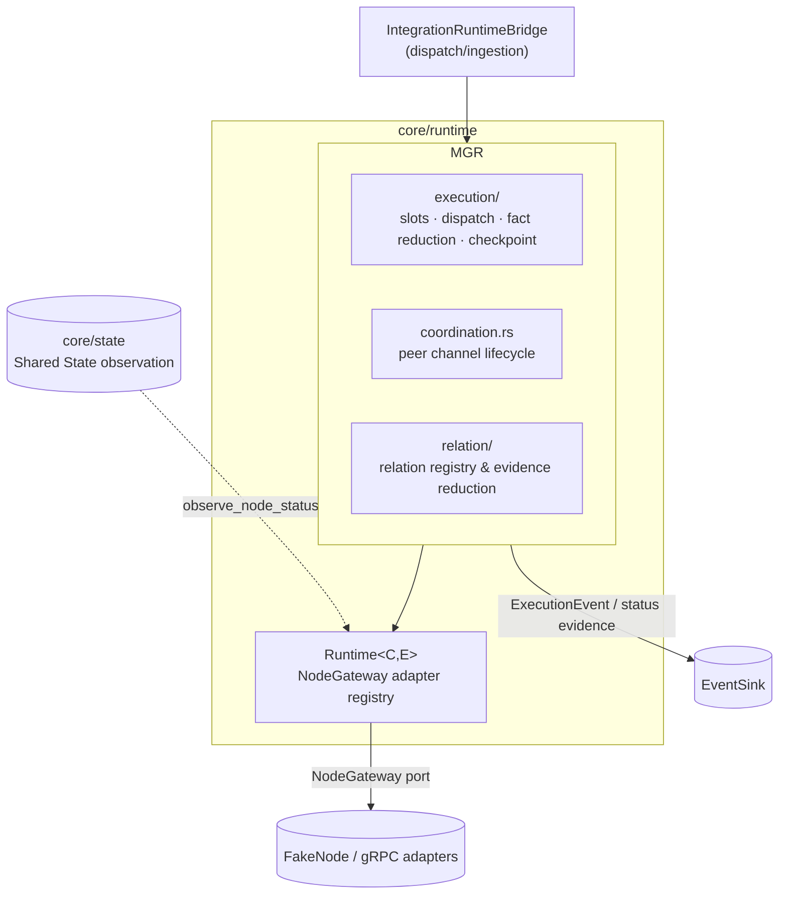
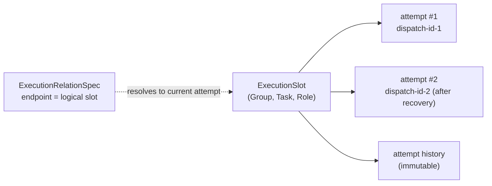
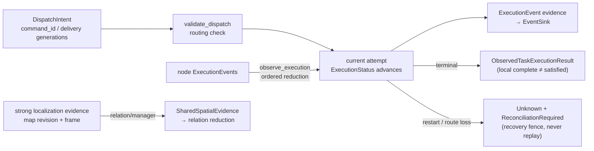
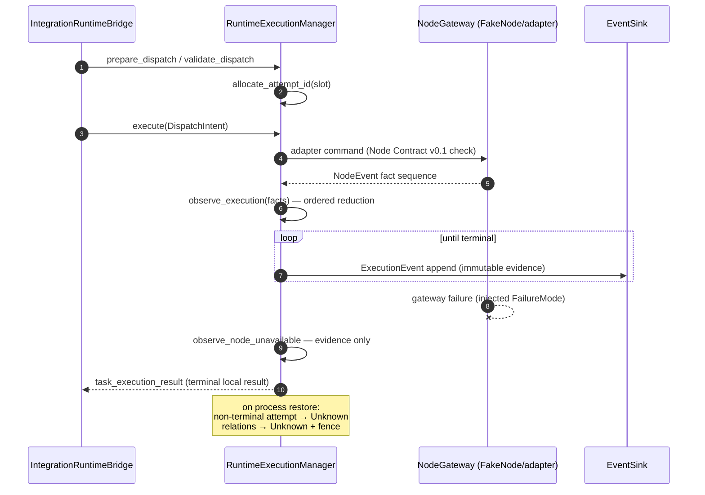

# Module map: Distributed Runtime

Crate: [`core/runtime`](https://github.com/Farewell-CK/RoboGuide/tree/main/core/runtime)
(~3,200 LOC production + ~1,400 LOC tests). Module map home ·
Previous: [Orchestration](orchestration.md) · Next: [State & Memory](state.md)

**Position** (lib.rs): the runtime execution semantics layer between Control
and local node adapters. It owns two authorities: `Runtime<C,E>` (a registry of
local `NodeGateway` adapters enforcing Node Contract version checks, health/
liveness observation, and event-evidence appends) and `RuntimeExecutionManager`
(the transport-neutral live execution authority: dispatch intents, attempt
generations, coordination contexts and peer channels, execution relations,
strong localization evidence, durable checkpoints).

## Position in the architecture

Runtime carries committed executions, talks to adapters/fact streams downward,
and provides only evidence upward — it makes no commitment or satisfaction
decisions:

## Logical slots vs physical attempts

The core identity model: Mission-semantic endpoints are **logical slots**
`(ExecutionGroupId, TaskRef, RoleId)`; the same slot is occupied by a new
physical attempt after recovery/re-dispatch, and `attempt_history()` keeps the
immutable history. Execution-relation endpoints therefore never break on
rebind.

## Data flow

## Dispatch and fact-reduction sequence

## Peer channel lifecycle

`Planned → Ready → Fenced → Closed`: Ready requires non-expired, receive-
relative readiness evidence from both ends; expiry, route loss, or restart
fence the channel — waiting Tasks stay durably Ready and are dispatched by the
existing event loop once evidence holds.

## Key types

`RuntimeExecutionManager`, `RuntimeExecutionCheckpoint` (create/restore),
`DispatchIntent` (durable dispatch intent with `command_id()` and delivery
generations), `ExecutionStatus` / `ExecutionEvent` / `ExecutionRuntimeError`
(`is_terminal()`), `ExecutionAttemptSnapshot`, `ObservedTaskExecutionResult`,
`RuntimePeerChannel` / `PeerChannelLifecycle` / `CoordinationReadiness`,
`RuntimeExecutionRelation` / `SharedSpatialEvidence`.

## Test coverage

Coordination lifecycle; live execution authority (dispatch/cancel/attempt
history/checkpoint); execution relations (registration, evidence reduction,
shared-spatial evidence validation); health observation into Shared State,
gateway failure vs liveness separation, unknown contract-version rejection.

## Implementation status

- Node Contract pinned to `NODE_CONTRACT_VERSION_V0_1` (adapter registration
  rejects other versions).
- Checkpoints are serde-serialized durable projections; restore paths
  `restore_coordination_maps` / `restore_relation_maps` exist explicitly, with
  no TODO markers.

## Related ADRs

[0015 Runtime execution boundary](../docs/decisions/0015-runtime-execution-boundary.md) ·
[0020 Execution coordination relations](../docs/decisions/0020-execution-coordination-relations.md) ·
[0026 Execution coupling & group views](../docs/decisions/0026-execution-coupling-and-group-views.md) ·
[0027 Coordination evidence completion](../docs/decisions/0027-runtime-coordination-evidence-completion.md) ·
[0028 Durable command, recovery & attempts](../docs/decisions/0028-durable-command-recovery-and-attempts.md)

---

Module maps: [Domain & ports](domain-ports.md) · [Control](control.md) ·
[Orchestration](orchestration.md) · [Runtime](runtime.md) ·
[State & Memory](state.md) · [Integration & Node](integration-node-service.md) ·
[Mission Intelligence](mission.md) · [Eval & integrations](evaluation.md)
