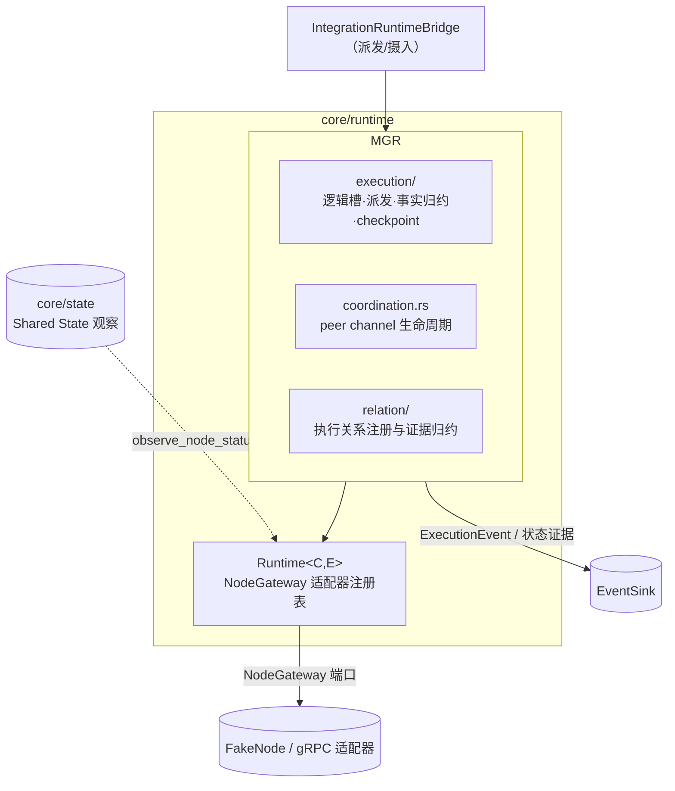
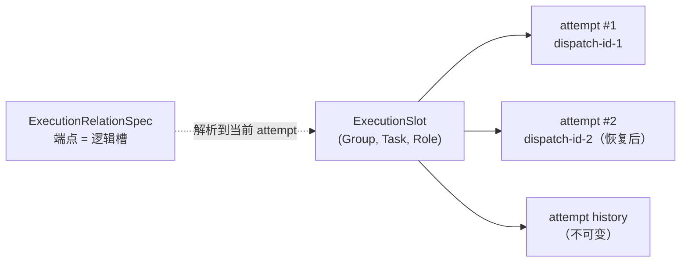
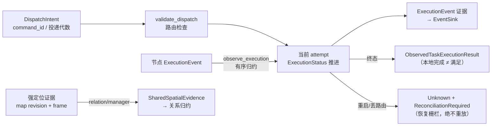
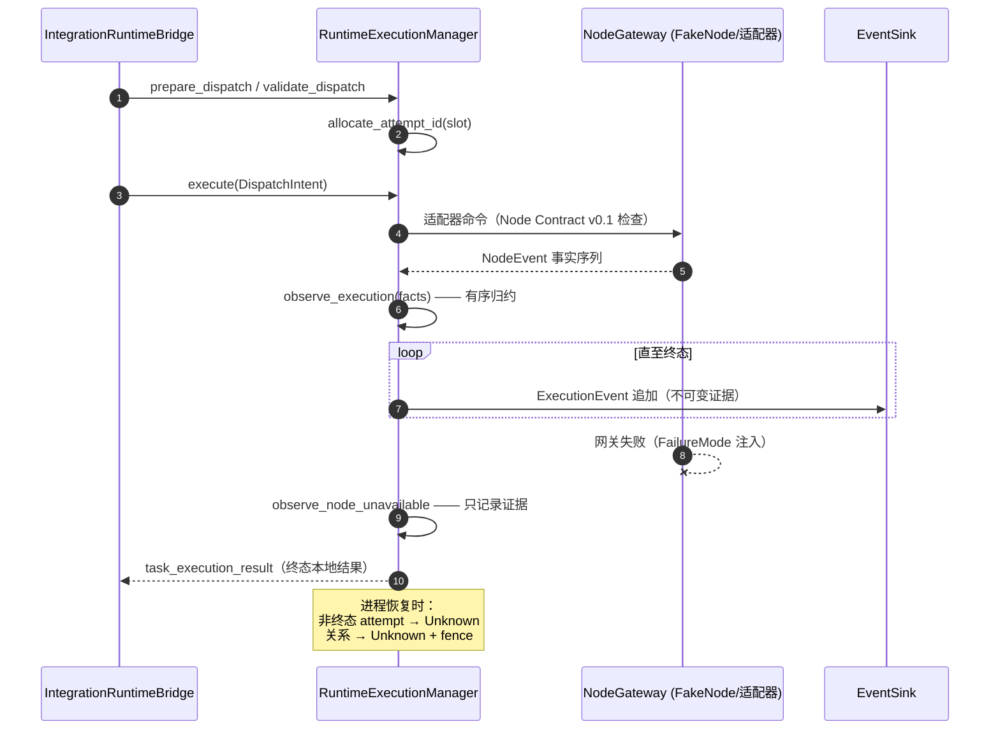

# 模块地图：Distributed Runtime

对应 crate：[`core/runtime`](https://github.com/Farewell-CK/RoboGuide/tree/main/core/runtime)
（约 3,200 行产品代码 + 1,400 行测试）。
模块地图首页 · 上一篇：[Orchestration](orchestration.md) · 下一篇：[State & Memory](state.md)

**定位**（lib.rs）：Control 与本地节点适配器之间的运行时执行语义层。持有两个权威：
`Runtime<C,E>`（本地 `NodeGateway` 适配器注册表，执行 Node Contract 版本检查、
健康/活性观察与事件证据追加）与 `RuntimeExecutionManager`（传输中立的活执行权威：
派发意图、尝试代际、协同上下文与 peer channel、执行关系、强定位证据、durable checkpoint）。

## 架构位置

Runtime 承接已 Commit 的执行，向下对接适配器/事实流，向上只提供证据，不做任何
承诺或满足决策：

## 逻辑槽与尝试分离

核心身份模型：Mission 语义端点是**逻辑槽** `(ExecutionGroupId, TaskRef, RoleId)`；
同一槽位在恢复/重派发时由新的物理 attempt 占据，`attempt_history()` 保留不可变
历史。执行关系的端点因此从不因 rebind 失效。

## 数据流

## 派发与事实归约时序

## Peer channel 生命周期

`Planned → Ready → Fenced → Closed`：两端非过期、receive 相对的 readiness 证据
齐备才 Ready；过期、丢路由、重启都会 fence——等待中的 Task 保持 durable Ready，
由既有事件循环在证据成立后派发。

## 关键类型

`RuntimeExecutionManager`、`RuntimeExecutionCheckpoint`（create/restore）、
`DispatchIntent`（durable 派发意图，含 `command_id()` 与投递代数）、
`ExecutionStatus` / `ExecutionEvent` / `ExecutionRuntimeError`（`is_terminal()`）、
`ExecutionAttemptSnapshot`、`ObservedTaskExecutionResult`、
`RuntimePeerChannel` / `PeerChannelLifecycle` / `CoordinationReadiness`、
`RuntimeExecutionRelation` / `SharedSpatialEvidence`。

## 测试覆盖

协同生命周期；活执行权威（派发/取消/尝试历史/checkpoint）；执行关系（注册、
证据归约、共享空间证据校验）；健康观察写入 Shared State、网关失败与活性分离、
未知契约版本拒绝。

## 实现状态

- Node Contract 固定在 `NODE_CONTRACT_VERSION_V0_1`（适配器注册拒收其他版本）。
- checkpoint 为 serde 序列化的持久投影；恢复路径 `restore_coordination_maps` /
  `restore_relation_maps` 显式存在，无 TODO 标记。

## 相关 ADR

[0015 Runtime 执行边界](../docs/decisions/0015-runtime-execution-boundary.md) ·
[0020 执行协同关系](../docs/decisions/0020-execution-coordination-relations.md) ·
[0026 执行耦合与组视图](../docs/decisions/0026-execution-coupling-and-group-views.md) ·
[0027 协同证据补全](../docs/decisions/0027-runtime-coordination-evidence-completion.md) ·
[0028 持久命令、恢复与物理尝试](../docs/decisions/0028-durable-command-recovery-and-attempts.md)

---

模块地图：[Domain 与端口](domain-ports.md) · [Control](control.md) ·
[Orchestration](orchestration.md) · [Runtime](runtime.md) ·
[State & Memory](state.md) · [Integration 与 Node](integration-node-service.md) ·
[Mission Intelligence](mission.md) · [Eval 与集成](evaluation.md)
