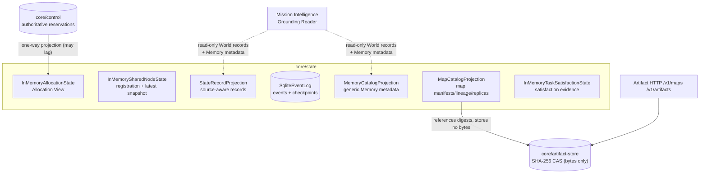
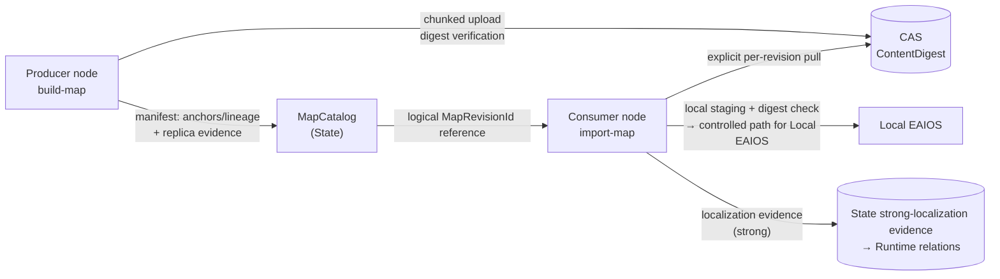

# Module map: State & Memory Plane

Crates: [`core/state`](https://github.com/Farewell-CK/RoboGuide/tree/main/core/state)
(~2,400 LOC production + ~1,400 LOC tests) and
[`core/artifact-store`](https://github.com/Farewell-CK/RoboGuide/tree/main/core/artifact-store)
(~1,200 LOC production + ~360 LOC tests). Module map home ·
Previous: [Runtime](runtime.md) · Next: [Integration & Node](integration-node-service.md)

**Position**: the implemented projection facade of the State & Memory Plane.
The core principle is written into the code: State is not Global Truth — every
record is kept with its source, projections may lag their authorities, and the
plane never exercises grant/revoke power.

## Position in the architecture



## Data flow: map publication and import

The complete data plane of Spatial Memory Slice v0.1 — manifests and bytes
strictly separated:



## Sequence: one controlled map import

```mermaid
sequenceDiagram
    autonumber
    participant NS as roboguide-node
    participant AH as Artifact HTTP (/v1/artifacts)
    participant CAS as ArtifactBlobStore
    participant MC as MapCatalog (State)
    participant LE as Local EAIOS

    NS->>MC: query the MapRevision manifest
    MC-->>NS: manifest + ContentDigest
    NS->>AH: GET /v1/artifacts/{digest} (streamed chunks)
    AH->>CAS: read blob
    AH-->>NS: byte stream
    NS->>NS: staging digest verification per chunk
    alt digest mismatch
        NS->>NS: reject; keep staging until abort
    else verified
        NS->>LE: deliver controlled local path
        NS->>MC: record Staged/Imported replica evidence
        Note over NS,MC: the Node Protocol never carries map bytes
    end
```

## core/state module map

| Module | Type | Responsibility |
| --- | --- | --- |
| `node.rs` | `InMemorySharedNodeState` | Shared Node State (registration + latest shared snapshot) |
| `allocation.rs` | `InMemoryAllocationState` | deterministic storage of normalized Allocation View snapshots |
| `event_log.rs` | `SqliteEventLog` | durable event log and Controller checkpoints (batched transactions, sequence paging, schema-marker matrix) |
| `state_record.rs` | `StateRecordProjection` | rebuildable projection of independently attributed State records |
| `memory.rs` | `MemoryCatalogProjection` | generic Memory manifest and placement evidence catalog (metadata only) |
| `spatial_memory.rs` | `MapCatalogProjection` | spatial-memory catalog: manifests/lineage/replica evidence — **bytes stay in the CAS** |
| `task_satisfaction.rs` | `InMemoryTaskSatisfactionState` | independently attributed Task satisfaction evidence projection |

**Test themes**: Allocation stable ordering and atomic replace/reject; SQLite
reopen survival, checkpoint atomicity, the v2–v10 schema-marker migration
matrix (including the v6 no-provider-identity replica migration); spatial
memory publish/import/conflict rejection; satisfaction evidence attribution.

## core/artifact-store (Artifact data plane)

**Position**: the filesystem implementation of `ports::ArtifactBlobStore`.
Content-addressed (SHA-256), immutable, chunked upload; stores opaque bytes
only and holds no map, task, or ownership policy.

| Module | Responsibility |
| --- | --- |
| `digest.rs` | canonical digest parsing and streaming calculation |
| `path_validation.rs` | symlink-safe path validation and durable mutation primitives |
| `store.rs` | initialization, lookup, verification |
| `upload.rs` | staged upload lifecycle and finalized metadata |
| `port_adapter.rs` | transport-neutral port adapters over the filesystem store |

**Test themes**: chunked upload/streaming read; digest mismatch retains staging
until abort; retry dedup; conflicting blob rejection; publication re-hash
verification; abandoned-staging cleanup on init; writer-lock fencing; symlink
rejection at every level.

## Memory semantics cheat sheet

- **Scope / Visibility / Placement are independent**: `Local + Discoverable` is
  valid; an Artifact reference only proves CAS byte identity, never node-local
  placement.
- The durable replica identity is `(MemorySelector, NodeId,
  ConsumerProviderId)`; `Imported` evidence is monotonic and is never degraded
  by later failed attempts.
- `/v1/memories` exposes map revisions read-only; publication still goes
  through `/v1/maps` with full validation.

## Implementation status

- Implemented: Shared Node State, Allocation v0.1, source-aware State record
  projection, generic/spatial Memory catalogs, SQLite event log and
  checkpoints, the filesystem CAS store.
- Not finished (deliberately open in V2): the full State & Memory Plane's
  Belief/fusion, Task/Group history projections, cross-Controller replication;
  the Node Protocol has no selective-import command yet.

## Related ADRs

[0005 Allocation projection authority](../docs/decisions/0005-allocation-state-projection-authority.md) ·
[0011 Event evidence codec](../docs/decisions/0011-event-evidence-codec.md) ·
[0012 Controller checkpoint](../docs/decisions/0012-controller-checkpoint-recovery.md) ·
[0016 Distributed spatial memory](../docs/decisions/0016-distributed-spatial-memory.md) ·
[0022 Retire legacy adapters & isolate the artifact store](../docs/decisions/0022-retire-legacy-adapters-and-isolate-artifact-store.md) ·
[0024 Federated state & selective memory](../docs/decisions/0024-federated-state-and-selective-memory.md) ·
[0025 Memory provider backend & workflow](../docs/decisions/0025-memory-provider-backend-and-workflow.md) ·
[0033 Task satisfaction boundary](../docs/decisions/0033-task-satisfaction-boundary.md)

---

Module maps: [Domain & ports](domain-ports.md) · [Control](control.md) ·
[Orchestration](orchestration.md) · [Runtime](runtime.md) ·
[State & Memory](state.md) · [Integration & Node](integration-node-service.md) ·
[Mission Intelligence](mission.md) · [Eval & integrations](evaluation.md)
