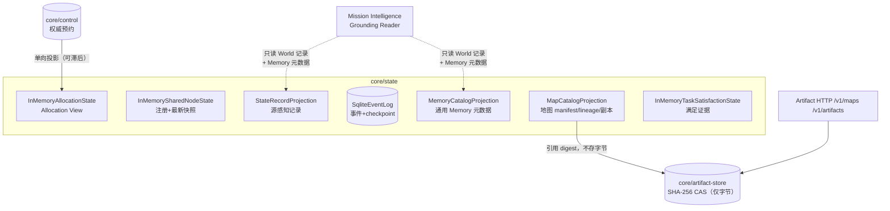
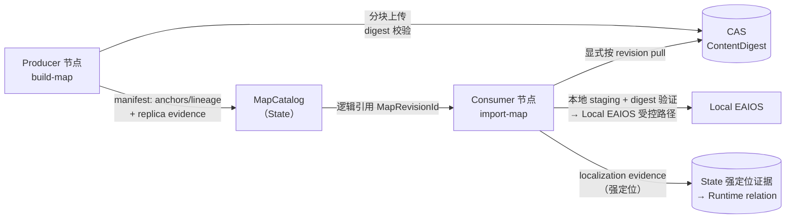
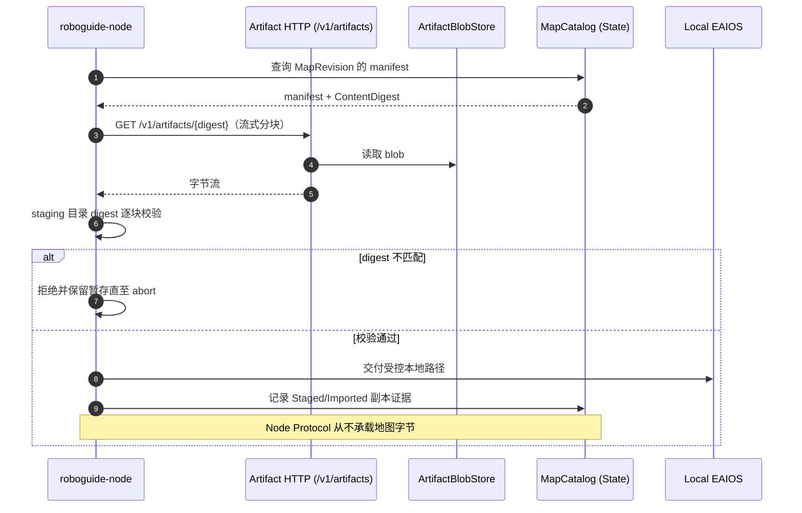

# 模块地图：State & Memory Plane

对应 crate：[`core/state`](https://github.com/Farewell-CK/RoboGuide/tree/main/core/state)
（约 2,400 行产品代码 + 1,400 行测试）、
[`core/artifact-store`](https://github.com/Farewell-CK/RoboGuide/tree/main/core/artifact-store)
（约 1,200 行产品代码 + 360 行测试）。
模块地图首页 · 上一篇：[Runtime](runtime.md) · 下一篇：[Integration 与 Node](integration-node-service.md)

**定位**：State & Memory Plane 的已实现投影门面。核心原则写在代码里：State 不是
Global Truth——每条记录带来源独立保留，投影可落后于权威，绝不行使承诺/撤销权力。

## 架构位置

## 数据流：地图的发布与导入

Spatial Memory Slice v0.1 的完整数据面——manifest 与字节严格分离：

## 时序：一次受控地图导入

## core/state 模块地图

| 模块 | 实现类型 | 职责 |
| --- | --- | --- |
| `node.rs` | `InMemorySharedNodeState` | Shared Node State（注册 + 最新共享快照） |
| `allocation.rs` | `InMemoryAllocationState` | 规范化 Allocation View 快照的确定性存储 |
| `event_log.rs` | `SqliteEventLog` | 持久事件日志与 Controller checkpoint（批量事务、序列分页、schema 标记矩阵） |
| `state_record.rs` | `StateRecordProjection` | 独立带来源 State 记录的可重建投影 |
| `memory.rs` | `MemoryCatalogProjection` | 通用 Memory manifest 与放置证据目录（仅元数据） |
| `spatial_memory.rs` | `MapCatalogProjection` | 空间记忆目录：manifest/lineage/副本证据，**字节留在 CAS** |
| `task_satisfaction.rs` | `InMemoryTaskSatisfactionState` | 独立带来源的 Task 满足证据投影 |

**测试主题**：Allocation 稳定排序与原子替换/拒绝；SQLite 重开存活、checkpoint
原子性、v2–v10 schema 标记迁移矩阵（含 v6 副本无 provider 身份迁移）；空间记忆
发布/导入/冲突拒绝；满足证据归属。

## core/artifact-store（Artifact 数据平面）

**定位**：`ports::ArtifactBlobStore` 的文件系统实现。内容寻址（SHA-256）、
不可变、分块上传；只存不透明字节，不懂地图/任务/所有权策略。

| 模块 | 职责 |
| --- | --- |
| `digest.rs` | 规范摘要解析与流式计算 |
| `path_validation.rs` | 符号链接安全的路径校验与持久变更原语 |
| `store.rs` | 初始化、查找、验证 |
| `upload.rs` | 分阶段上传生命周期与终结元数据 |
| `port_adapter.rs` | 文件系统存储之上的传输中立端口适配 |

**测试主题**：分块上传/流式读；摘要不匹配保留暂存直至 abort；重试去重；
冲突 blob 拒绝；发布验证重哈希；初始化清理遗留暂存；写锁栅栏；各层符号链接拒绝。

## Memory 语义速记

- **Scope / Visibility / Placement 独立**：`Local + Discoverable` 合法；Artifact
  引用只证明 CAS 字节身份，不证明节点本地放置。
- 副本持久身份是 `(MemorySelector, NodeId, ConsumerProviderId)`；`Imported`
  证据单调，不因后续失败尝试降级。
- `/v1/memories` 只读暴露地图 revision，发布仍走 `/v1/maps` 强校验。

## 实现状态

- 已实现：Shared Node State、Allocation v0.1、源感知 State 记录投影、通用/空间
  Memory 目录、SQLite 事件日志与 checkpoint、CAS 文件存储。
- 未完成（V2 有意保留）：完整 State & Memory Plane 的 Belief/fusion、Task/Group
  历史投影、跨 Controller 复制；Node Protocol 尚无 selective-import 命令。

## 相关 ADR

[0005 Allocation 投影权威](../docs/decisions/0005-allocation-state-projection-authority.md) ·
[0011 事件证据编解码](../docs/decisions/0011-event-evidence-codec.md) ·
[0012 Controller checkpoint](../docs/decisions/0012-controller-checkpoint-recovery.md) ·
[0016 分布式空间记忆](../docs/decisions/0016-distributed-spatial-memory.md) ·
[0022 退役旧适配器并隔离 Artifact Store](../docs/decisions/0022-retire-legacy-adapters-and-isolate-artifact-store.md) ·
[0024 联邦 State 与选择性 Memory](../docs/decisions/0024-federated-state-and-selective-memory.md) ·
[0025 Memory Provider 后端与工作流](../docs/decisions/0025-memory-provider-backend-and-workflow.md) ·
[0033 Task 满足边界](../docs/decisions/0033-task-satisfaction-boundary.md)

---

模块地图：[Domain 与端口](domain-ports.md) · [Control](control.md) ·
[Orchestration](orchestration.md) · [Runtime](runtime.md) ·
[State & Memory](state.md) · [Integration 与 Node](integration-node-service.md) ·
[Mission Intelligence](mission.md) · [Eval 与集成](evaluation.md)
